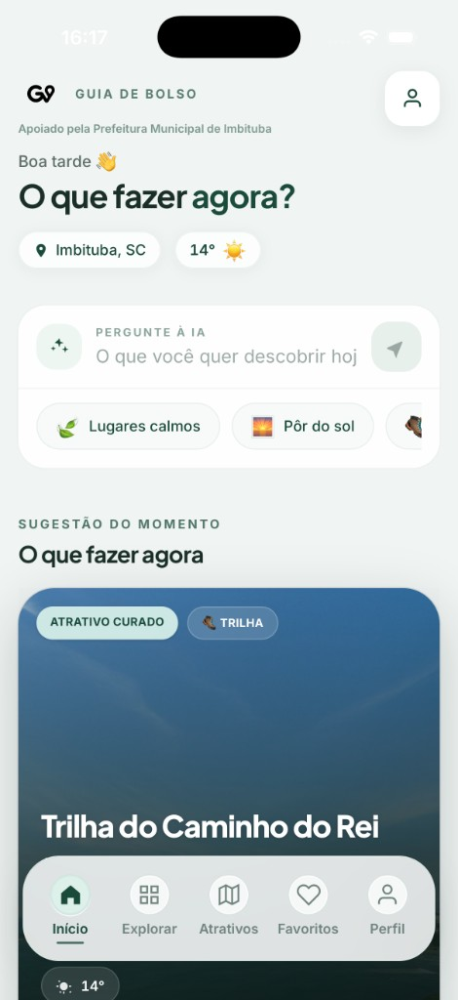
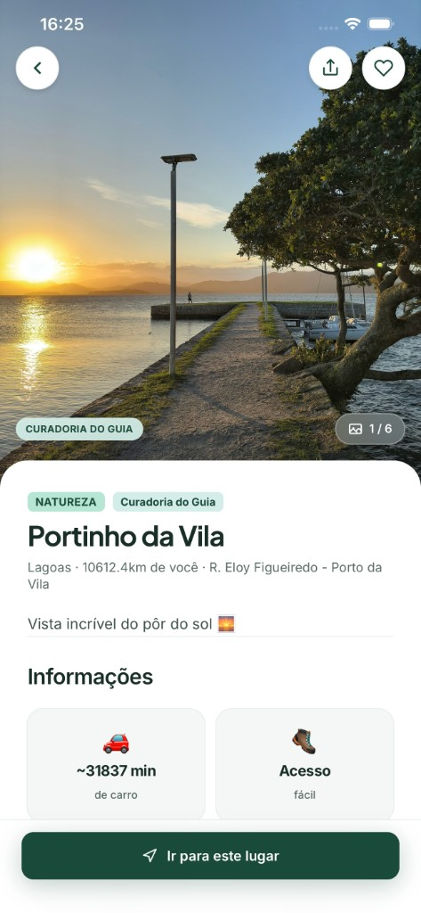

<h1 align="center">Guia de Bolso</h1>

<p align="center">
  <strong>AI-powered local discovery for Brazil’s southern coast</strong><br />
  Real-time recommendations for Imbituba, Santa Catarina
</p><br>

<p align="center">
  <a href="https://guiadebolso.app"><strong>Live application</strong></a>
  &nbsp;·&nbsp;
  <a href="./docs/README.md"><strong>Documentação técnica</strong></a>
  &nbsp;·&nbsp;
  <a href="https://github.com/BrunoDislilerDev/guia-de-bolso/issues">Report an issue</a>
</p>

<p align="center">
  
  
  
  
  
  
</p>

---

## Table of contents

- [Overview](#overview)
- [Product capabilities](#product-capabilities)
- [Screenshots](#screenshots)
- [Technology stack](#technology-stack)
- [Getting started](#getting-started)
- [Environment variables](#environment-variables)
- [Production deployment](#production-deployment)
- [Project structure](#project-structure)
- [Documentation](#documentation)
- [Security](#security)
- [Roadmap](#roadmap)
- [Contributing](#contributing)
- [Author](#author)

---

## Overview

**Guia de Bolso** is a mobile-first web application that helps residents and visitors decide **what to do right now**—not merely where to go.

The product combines a curated place catalog, live context (opening hours, geolocation, time-of-day messaging), moderated social proof, and **Anthropic Claude**–powered natural-language search and trip planning. An internal admin console supports content operations, review moderation, and commercial placement for partner businesses.

| | |
|---|---|
| **Production URL** | https://guiadebolso.app |
| **Service region** | Imbituba, SC, Brazil |
| **Primary interface** | Portuguese (pt-BR) |
| **Target devices** | Mobile web (optimized ~390px viewport) |

### Problem & solution

| Audience | Need | How Guia de Bolso addresses it |
|----------|------|--------------------------------|
| Tourists | Low-friction discovery without heavy planning | Contextual home, AI search, ready-made “plans,” turn-by-turn handoff |
| Residents | Know what is open and nearby, immediately | Live hours, distance, filters (open / closed / all) |
| Local businesses | Visibility in the official regional guide | Listings, highlights, commercial tiers (roadmap: self-service portal) |

---

## Product capabilities

### Consumer experience

- **Decision-oriented home** — contextual header, AI search with quick prompts, hero suggestion (“what to do now”), **Parceiros** carousel (active commercial highlights), trending places, preset itineraries, nearby discovery; two-phase loading with per-section fallback when data fails
- **Explorar** (`/categorias`) — category discovery with mood shortcuts, featured categories, and AI search entry
- **Conversion-focused place pages** — immersive hero, persuasive copy, quick actions (establishments vs. public venues), reviews summary, fixed navigation CTA
- **Category exploration** — full taxonomy via `/categorias` and filtered listings
- **Authentication** — Google OAuth and SMS OTP (Supabase Auth + Twilio)
- **Engagement** — favorites, moderated reviews, share, onboarding flow
- **Resilient UX** — skeleton loaders, visible error banners, hybrid image delivery (`RemotePhoto` + `next/image`), shared design tokens and focus styles (see [`docs/features.md`](./docs/features.md) §26)

### Guia Premium (subscription)

| Capability | Free (signed in) | Premium |
|------------|------------------|---------|
| AI place search | 5 / day (resets at midnight, Brasília) | Unlimited |
| AI trip itinerary | 2 / day (resets at midnight, Brasília) | Unlimited |
| `ClimaCard` beach weather UI | Not on home (header uses Open-Meteo phrase only) | Full sheet when component is mounted |

*Billing integration (Asaas) is on the roadmap; paywall UI is implemented.*

### Operations & admin

Role-gated console at `/admin`: operational dashboard, place and route CRUD, review moderation, commercial highlights (Parceiro plan), user roles, **activity logs** (`/admin/logs`), and **taxonomy** CRUD for subcategorias/tags (`/admin/taxonomia`). Responsive shell: sidebar (desktop), drawer (mobile/tablet), alert bell.

---

## Screenshots

Place exported images under `docs/screenshots/` using the filenames below.

<table>
  <tr>
    <td align="center" width="50%">
      <br />
      <sub><b>Home</b> — contextual assistant, AI search, hero recommendation</sub>
    </td>
    <td align="center" width="50%">
      <br />
      <sub><b>Place detail</b> — immersive hero, actions, fixed CTA</sub>
    </td>
  </tr>
  <tr>
    <td align="center">
      <br />
      <sub><b>AI search</b> — natural language + open/closed filters</sub>
    </td>
    <td align="center">
      <br />
      <sub><b>Routes</b> — curated trails + AI-generated itineraries</sub>
    </td>
  </tr>
  <tr>
    <td align="center">
      <br />
      <sub><b>Authentication</b> — OAuth & SMS</sub>
    </td>
    <td align="center">
      <br />
      <sub><b>Admin</b> — content & moderation</sub>
    </td>
  </tr>
</table>

Recommended capture size: **390×844** (mobile viewport). See `docs/screenshots/.gitkeep` for file naming.

---

## Technology stack

| Layer | Technology | Responsibility |
|-------|------------|----------------|
| Application | **Next.js 16** (App Router) | Routing, SSR/CSR, API route handlers |
| UI | **React 19**, **Tailwind CSS 4** | Component layer, design system |
| Data | **Supabase** (PostgreSQL) | Persistence, RLS, SQL migrations |
| Identity | **Supabase Auth** | Sessions, OAuth, phone OTP |
| Assets | **Supabase Storage** | Place, route, and profile media |
| AI | **Anthropic Claude** | Semantic search ranking, itinerary generation |
| Maps | Google / Apple / Waze (deep links) | End-user navigation |
| Weather | **Open-Meteo** | Forecast data (no API key required) |
| Hosting | **Vercel** | Build, deploy, edge delivery |
| Runtime | **Node.js 20+**, **JavaScript** | Application language (no TypeScript) |

### Server API surface

| Endpoint | Method | Purpose |
|----------|--------|---------|
| `/api/health` | `GET` | Deploy smoke check |
| `/api/lugares` | `GET` | Public catalog (CDN-cacheable) |
| `/api/buscar` | `POST` | AI-powered place search |
| `/api/roteiro` | `POST` | Generate multi-day itinerary |
| `/api/roteiro/salvar` | `POST` | Persist user itinerary |
| `/api/uso-premium` | `GET` | Subscription usage quotas |

Full contracts: [`docs/api.md`](./docs/api.md).

---

## Getting started

### Prerequisites

- Node.js **20+**
- npm
- Git
- Supabase project (database + auth configured)
- Anthropic API key

### Local setup

```bash
git clone https://github.com/BrunoDislilerDev/guia-de-bolso.git
cd guia-de-bolso
npm install
cp .env.example .env.local
# Edit .env.local with your credentials
npm run dev
```

Open [http://localhost:3000](http://localhost:3000).

### Database migrations

Apply SQL scripts in the Supabase **SQL Editor** using the ordered manifest in [`docs/migrations.md`](./docs/migrations.md#manifest). Architecture and performance notes: [`docs/DATABASE_ARCHITECTURE.md`](./docs/DATABASE_ARCHITECTURE.md).

### NPM scripts

| Command | Description |
|---------|-------------|
| `npm run dev` | Development server |
| `npm run build` | Production build |
| `npm run start` | Run production build locally |
| `npm run lint` | ESLint |

---

## Environment variables

Copy [`.env.example`](./.env.example) to `.env.local`. Full reference (scopes, Vercel, CI): **[`docs/environment.md`](./docs/environment.md)**.

| Variable | Required | Scope |
|----------|:--------:|-------|
| `NEXT_PUBLIC_SUPABASE_URL` | Yes | Client + server |
| `NEXT_PUBLIC_SUPABASE_ANON_KEY` | Yes | Client + server |
| `ANTHROPIC_API_KEY` | Yes | Server only |
| `ANTHROPIC_MODEL` | Recommended | Server only |

**Auth redirect URLs** (Supabase Dashboard → Authentication): see [`docs/authentication.md`](./docs/authentication.md).

---

## Production deployment

The application deploys to **Vercel** on push to the default branch.

### 1. Vercel project

| Setting | Value |
|---------|--------|
| Framework | Next.js |
| Build command | `npm run build` |
| Install command | `npm install` |
| Node.js version | 20.x |

### 2. Environment configuration

Mirror all variables from `.env.local` in **Vercel → Settings → Environment Variables** for Production (and Preview environments if used).

### 3. Supabase (production)

- Run migrations from `/supabase` on the production project
- Register production domain in Auth redirect allowlist
- Verify Storage buckets and RLS policies

### 4. Post-deploy verification

- [ ] Home loads with place data
- [ ] Sign-in (Google / SMS) completes callback
- [ ] Authenticated AI search returns results and increments usage
- [ ] Place detail navigation CTA opens maps provider
- [ ] Admin routes reject non-admin roles

Detailed runbook: [`docs/deployment.md`](./docs/deployment.md).

### Release pipeline

```text
git push → Vercel build → Production
```

---

## Project structure

Full tree: **[`docs/project-structure.md`](./docs/project-structure.md)**.

```text
guia-de-bolso/
├── app/                 # Next.js routes & API handlers
├── components/          # UI by domain (home/, lugar/, admin/, …)
├── hooks/               # Shared React hooks
├── lib/                 # Domain logic & Supabase clients
├── supabase/            # SQL migrations (manual apply)
├── docs/                # ← Technical documentation (single source)
├── e2e/                 # Playwright smoke tests
└── .env.example         # Environment template
```

---

## Documentation

**Índice mestre (handoff para equipe):** **[docs/README.md](./docs/README.md)**

| Documento | Conteúdo |
|-----------|----------|
| [onboarding.md](./docs/onboarding.md) | Onboarding técnico |
| [architecture.md](./docs/architecture.md) | Arquitetura do sistema |
| [project-structure.md](./docs/project-structure.md) | Estrutura de pastas |
| [authentication.md](./docs/authentication.md) | Fluxo de autenticação |
| [data-flows.md](./docs/data-flows.md) | Fluxo de dados |
| [api.md](./docs/api.md) | APIs HTTP |
| [database.md](./docs/database.md) | Banco de dados |
| [conventions.md](./docs/conventions.md) | Convenções do projeto |
| [environment.md](./docs/environment.md) | Variáveis de ambiente |
| [architectural-decisions.md](./docs/architectural-decisions.md) | Decisões arquiteturais |
| [deployment.md](./docs/deployment.md) | Deploy e CI |
| [CODING_STANDARDS.md](./CODING_STANDARDS.md) | Estilo linha a linha |

---

## Security

- **Row Level Security (RLS)** enforced on Supabase tables
- AI keys and usage increments run **server-side only** (`app/api/*`)
- User-generated reviews require moderation before public display
- Administrative functions gated by `perfis.role`
- Atomic usage counters via `SECURITY DEFINER` SQL functions (`increment_busca_ia`, `increment_roteiro_ia`)

Report security concerns via [GitHub Issues](https://github.com/BrunoDislilerDev/guia-de-bolso/issues) (private disclosure process can be defined as the project matures).

---

## Roadmap

| Phase | Theme | Highlights |
|-------|-------|------------|
| **Q1** | Monetization | Recurring billing (Asaas), establishment self-service portal |
| **Q2** | Growth | Push notifications, voice search, PWA / offline baseline |
| **Q3** | Platform | Public-venue metadata in admin, local events, check-in feature |
| **Q4** | Enterprise | Municipal partnerships, Apple / WhatsApp auth, dark mode |

---

## Contributing

Contributions are welcome. Please read [`docs/contributing.md`](./docs/contributing.md) before opening a pull request.

1. Fork the repository  
2. Create a feature branch  
3. Ensure `npm run build` passes  
4. Submit a PR with a clear description and screenshots for UI changes  

---

## Author

**Bruno Disliler** — Full-stack developer building AI-powered consumer products.

- Website: [brunodisliler.com](https://brunodisliler.com)  
- GitHub: [@BrunoDislilerDev](https://github.com/BrunoDislilerDev)

---

<p align="center">
  <sub>Guia de Bolso · Local discovery infrastructure for the Litoral Catarinense</sub>
</p>

---

## Planejamento V2

### História e Cultura
Transformar o Guia de Bolso na memória digital de Imbituba,
oferecendo contexto histórico e cultural que nenhum guia local digital tem.
Foco em Imbituba como guia oficial da cidade.

**Estrutura planejada:**

História dentro do Explorar:
- [ ] Redesenhar a tela Explorar para incluir seção "Conheça a região" 
      no topo, além das categorias existentes
- [ ] Card "História de Imbituba" abrindo página dedicada com texto rico, 
      fotos históricas e linha do tempo
- [ ] Página de história com seções: Origens, Influência Açoriana, 
      O Porto, A Pesca Artesanal, Crescimento do Turismo

História dentro do detalhe de cada local:
- [ ] Campo `historia` e `curiosidades` na tabela lugares (banco + admin)
- [ ] Seção "História e curiosidades" colapsável na página de detalhe 
      de cada lugar, com visual diferenciado (fundo levemente diferente, 
      ícone de livro)
- [ ] Integração com roteiro de IA — filtro "Monte um roteiro histórico 
      de Imbituba"
- [ ] Áudio guia futuro — narração gerada a partir do campo história 
      via Text-to-Speech

**Conteúdo prioritário para cadastrar:**
- Farol de Imbituba
- Porto de Imbituba  
- Centro histórico
- Praias com lendas e histórias locais
- Influência açoriana na arquitetura e culinária local

**Impacto esperado:**
Diferencial único — o app como memória digital viva de Imbituba.
Potencial de parceria com prefeitura, secretaria de cultura e 
historiadores locais.

### Outras features planejadas
- [ ] Notificações Push
- [ ] Busca por voz (Web Speech API + Claude API)
- [ ] Modo offline básico (PWA com service worker)
- [ ] QR Code do estabelecimento
- [ ] Check-in "Estou aqui agora" com contagem em tempo real
- [ ] Eventos locais (shows, feiras, festivais)
- [ ] Dark mode completo (CSS variables)
- [ ] Dark mode no admin
- [ ] Role "estabelecimento" com painel próprio
- [ ] Apple Sign In (pós Apple Developer Program)
- [ ] WhatsApp Auth (pós aprovação Meta)
