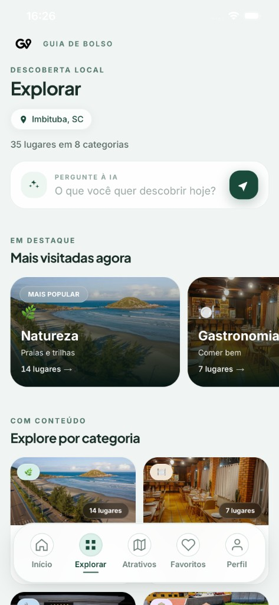
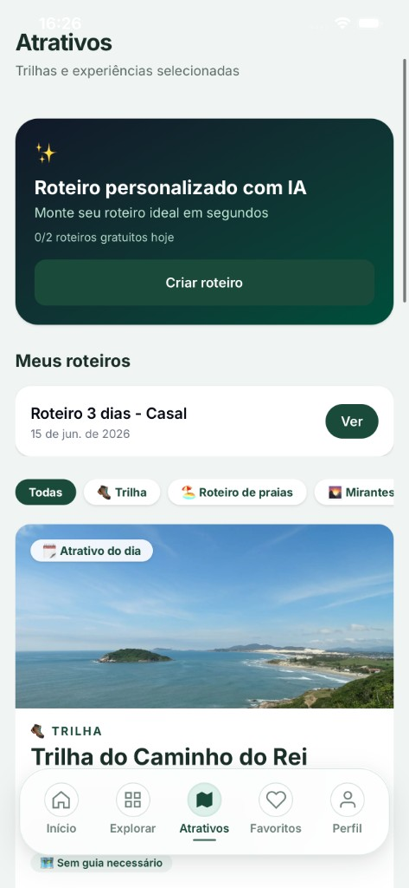

<h1 align="center">
  <br />
  Guia de Bolso
</h1>

<p align="center">
  <strong>Descoberta local com IA para Imbituba, Santa Catarina</strong><br />
  Web mobile-first + apps nativos que respondem <em>o que fazer agora?</em>
</p>

<p align="center">
  <a href="README.md"><strong>English</strong></a>
  &nbsp;·&nbsp;
  <a href="https://guiadebolso.app"><strong>App em produção</strong></a>
  &nbsp;·&nbsp;
  <a href="docs/README.md"><strong>Documentação técnica</strong></a>
  &nbsp;·&nbsp;
  <a href="docs/en/README.md"><strong>Technical handbook</strong></a>
</p>

<p align="center">
  <a href="https://github.com/BrunoDislilerDev/guia-de-bolso/actions/workflows/ci.yml"></a>
  
  
  
  
  
</p>

---

## Sumário

- [Visão geral](#visão-geral)
- [Produto](#produto)
- [Capturas de tela](#capturas-de-tela)
- [Arquitetura](#arquitetura)
- [Começando](#começando)
- [Documentação](#documentação)
- [Segurança](#segurança)
- [Roadmap](#roadmap)
- [Contribuir](#contribuir)
- [Licença](#licença)

---

## Visão geral

O **Guia de Bolso** é o guia da cidade de **Imbituba, SC**. Une catálogo curado (praias, restaurantes, trilhas, serviços), contexto ao vivo (horário, distância, clima), avaliações moderadas e **Anthropic Claude** para busca em linguagem natural e roteiros.

| | |
|---|---|
| **Produção** | [guiadebolso.app](https://guiadebolso.app) |
| **Lojas** | [App Store](https://apps.apple.com/br/app/guia-de-bolso-imbituba/id6784377524) · [Google Play](https://play.google.com/store/apps/details?id=app.guiadebolso) · link único [`/baixar`](https://guiadebolso.app/baixar) |
| **Idioma da UI** | Português (pt-BR) |
| **Viewport** | Mobile-first (~390px), centralizado no desktop |

### Para quem

| Público | Necessidade | Resposta do produto |
|---------|-------------|---------------------|
| Turistas | Decidir sem planejar | Home, busca IA, atrativos, Maps |
| Moradores | O que está aberto perto | Horários ao vivo, GPS, categorias |
| Comércio local | Presença no guia | Listagem, carrossel de parceiros, QR, relatórios |
| Operação | Manter o catálogo | CMS em `/admin` |

---

## Produto

### Consumidor

- Home contextual (clima, busca IA, atrativo do dia, parceiros, em alta, perto de você)
- Explorar (`/categorias`) com a mesma busca inteligente da home
- Detalhe do lugar: galeria, horários (dois turnos / virada de dia), ações rápidas, avaliações, IR AGORA (Google / Apple / Waze)
- **Atrativos** curados com modo guia e progresso de percurso
- Favoritos com cache offline (IndexedDB + service worker nas rotas de favorito)
- Auth: Google (web + nativo), SMS OTP, Sign in with Apple (iOS nativo)
- Busca por voz (nativa + Web Speech)
- Push no app nativo (opt-in no perfil)

### Guia Premium

| Capacidade | Logado (gratuito) | Premium |
|------------|-------------------|---------|
| Busca IA | **10 / dia** (zera à meia-noite, Brasília) | Ilimitado |
| Roteiro IA | **2 / dia** | Ilimitado |

Cobrança nas lojas: Google Play + App Store IAP. Portal do estabelecimento + Asaas continua no roadmap.

### Operação

`/admin` por `perfis.role`:

- **admin** — locais, atrativos, moderação, relatórios
- **dev** — parceiros, contratos, usuários, logs, taxonomia, custos de IA, despesas, push

---

## Capturas de tela

<table>
  <tr>
    <td align="center" width="25%">
      <br />
      <sub><b>Home</b></sub>
    </td>
    <td align="center" width="25%">
      <br />
      <sub><b>Detalhe</b></sub>
    </td>
    <td align="center" width="25%">
      <br />
      <sub><b>Explorar</b></sub>
    </td>
    <td align="center" width="25%">
      <br />
      <sub><b>Atrativos</b></sub>
    </td>
  </tr>
</table>

---

## Arquitetura

```text
Browser / Capacitor  →  Next.js 16 (Vercel)  →  Supabase (Postgres + Auth + Storage)
                                      ↘ Anthropic Claude (busca e roteiros)
                                      ↘ Open-Meteo, FCM, IAP Play / App Store
```

| Camada | Stack |
|--------|--------|
| App | Next.js 16 App Router, React 19, Tailwind CSS 4, **JavaScript** (sem TypeScript) |
| Dados | Supabase PostgreSQL (`us-west-2`), RLS em toda tabela exposta |
| Identidade | Supabase Auth (Google, SMS, Apple no iOS) |
| Nativo | Capacitor 8 (`android/`, `ios/`), bundle `app.guiadebolso` |
| Qualidade | `node --test` em `lib/*.test.js`, Playwright, GitHub Actions |

Segredos nunca vão para o browser. Cotas de IA são reservadas via RPC `SECURITY DEFINER` antes da Claude.

Diagramas: [`docs/architecture.md`](docs/architecture.md).

---

## Começando

**Pré-requisitos:** Node.js **20+** (`engines`: `>=20 <26`), npm, Git. Projeto Supabase próprio e chave Anthropic se for **fork** (chaves de produção não estão no repositório).

```bash
git clone https://github.com/BrunoDislilerDev/guia-de-bolso.git
cd guia-de-bolso
npm install
cp .env.example .env.local
# Preencha NEXT_PUBLIC_SUPABASE_* e ANTHROPIC_API_KEY
npm run dev
```

Abra [http://localhost:3000](http://localhost:3000).

| Comando | Uso |
|---------|-----|
| `npm run dev` | Servidor local |
| `npm run lint` | ESLint |
| `npm test` | Testes unitários |
| `npm run check:api-security` | Docs de API vs handlers |
| `npm run build` | Build de produção |
| `npm run test:e2e` | Smoke Playwright (`npx playwright install chromium` na 1ª vez) |

**Fork / Supabase novo:** schema em [`docs/database.md`](docs/database.md); SQL na ordem de [`docs/migrations.md`](docs/migrations.md#manifest). Não há dump do catálogo de produção — proposital. Passo a passo: [`docs/onboarding.md`](docs/onboarding.md) · [`docs/en/getting-started.md`](docs/en/getting-started.md).

Variáveis: [`.env.example`](.env.example) · [`docs/environment.md`](docs/environment.md).

---

## Documentação

| Perfil | Comece aqui |
|--------|-------------|
| Engenheiro (PT) | [`docs/README.md`](docs/README.md) → [`docs/onboarding.md`](docs/onboarding.md) |
| Engenheiro (EN) | [`docs/en/README.md`](docs/en/README.md) |
| Fork do zero | [`docs/en/getting-started.md`](docs/en/getting-started.md) |
| APIs | [`docs/api.md`](docs/api.md) |
| Banco | [`docs/database.md`](docs/database.md) |
| Deploy | [`docs/deployment.md`](docs/deployment.md) |
| Produto | [`docs/features.md`](docs/features.md) |
| ADRs | [`docs/architectural-decisions.md`](docs/architectural-decisions.md) |

Padrões: [`CODING_STANDARDS.md`](CODING_STANDARDS.md) · atalho [`ENGINEERING_GUIDE.md`](ENGINEERING_GUIDE.md).

---

## Segurança

- RLS em catálogo, perfis, favoritos, avaliações, logs, storage
- Admin e APIs por role `admin` / `dev` (nunca só no cliente)
- Avaliações públicas só após moderação
- Vulnerabilidades: **contato@guiadebolso.app** — [`SECURITY.md`](SECURITY.md)

Não abra issue pública com detalhes de exploit.

---

## Roadmap

Já entregue (não tratar como TODO): push nativo, busca por voz, QR do estabelecimento, favoritos offline, Premium nas lojas.

| Tema | Próximo |
|------|---------|
| Comercial | Portal do estabelecimento; cobrança Asaas |
| Plataforma | Offline ampliado / PWA; WhatsApp Auth (Meta) |
| Produto | Eventos, check-in, camada de história da cidade, dark mode |

---

## Contribuir

Leia [`CONTRIBUTING.pt-BR.md`](CONTRIBUTING.pt-BR.md) ([English](CONTRIBUTING.md)) e o [Código de conduta](CODE_OF_CONDUCT.md).

1. Fork → branch (`feat/…`, `fix/…`, `docs/…`)
2. `npm run lint && npm test && npm run build`
3. Abra o PR com o template (prints se a UI mudar)

---

## Autor

**Bruno Disliler** — [brunodisliler.com](https://brunodisliler.com) · [@BrunoDislilerDev](https://github.com/BrunoDislilerDev)

---

## Licença

Ver [`LICENSE`](LICENSE). O código pode ser estudado e receber PRs; a marca **Guia de Bolso** e os dados de produção não estão licenciados para reuso.
