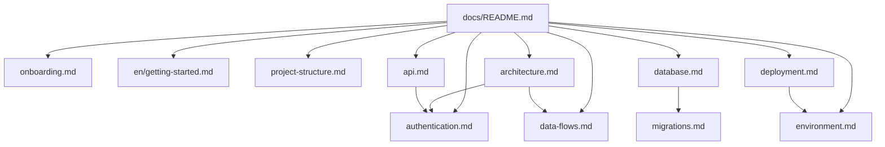

# Technical documentation — Guia de Bolso

**[English handbook](./en/README.md)** · **Português nesta página**

Fonte única para engenharia, DevOps, QA e produto. Produção: [guiadebolso.app](https://guiadebolso.app).

| Documento | Idioma |
|-----------|--------|
| [README.md](../README.md) | English (GitHub) |
| [README.pt-BR.md](../README.pt-BR.md) | Português |
| [Fork / ambiente próprio](./getting-started.md) | Português |
| [Fork from zero](./en/getting-started.md) | English |
| [Onboarding técnico](./onboarding.md) | Português |

Contexto para agentes de IA: [CLAUDE.md](../CLAUDE.md) (não substitui este handbook).

---

## Comece aqui

| Perfil | Rota de leitura |
|--------|-----------------|
| **Desenvolvedor novo** | [Onboarding](./onboarding.md) → [Estrutura](./project-structure.md) → [Arquitetura](./architecture.md) → [Convenções](./conventions.md) |
| **Fork / ambiente próprio** | [Getting started (PT)](./getting-started.md) · [Getting started (EN)](./en/getting-started.md) → [Migrations](./migrations.md) → [Ambiente](./environment.md) |
| **DevOps / release** | [Deploy](./deployment.md) → [Variáveis](./environment.md) → [Staging](./staging.md) |
| **Backend / dados** | [Banco](./database.md) → [Arquitetura do banco](./DATABASE_ARCHITECTURE.md) → [Fluxo de dados](./data-flows.md) → [RLS](./security-rls.md) |
| **API / integrações** | [APIs](./api.md) → [Autenticação](./authentication.md) → [ADRs](./architectural-decisions.md) |
| **Produto / QA** | [Features](./features.md) → [Checklist](./TESTING-CHECKLIST.md) |

---

## Índice

### Fundamentos

| Documento | Conteúdo |
|-----------|----------|
| [Onboarding técnico](./onboarding.md) | Setup, leituras, fluxos para validar |
| [Getting started (EN)](./en/getting-started.md) | Fork, Supabase próprio, o que o repo não inclui |
| [Estrutura de pastas](./project-structure.md) | `app/`, `components/`, `lib/`, `supabase/`, `e2e/` |
| [Arquitetura](./architecture.md) | Stack, rotas, diagramas |
| [Autenticação](./authentication.md) | OAuth, SMS, nativo, sessão, admin, Premium |
| [Push](./push-notifications.md) | FCM/APNs, tokens, envio |
| [Fluxo de dados](./data-flows.md) | Leituras, IA, writes, admin |
| [Convenções](./conventions.md) | Código, SQL, API, Git, testes |
| [ADRs](./architectural-decisions.md) | Decisões aceitas e propostas |

### Dados e APIs

| Documento | Conteúdo |
|-----------|----------|
| [APIs HTTP](./api.md) | Route Handlers, erros, premium |
| [Banco de dados](./database.md) | Tabelas, RLS, RPC |
| [Arquitetura do banco](./DATABASE_ARCHITECTURE.md) | Modelagem, índices, evolução |
| [Migrations](./migrations.md) | Ordem dos SQL em `/supabase` |
| [Segurança RLS](./security-rls.md) | Policies versionadas |

### Operações

| Documento | Conteúdo |
|-----------|----------|
| [Deploy](./deployment.md) | Vercel, Supabase, CI |
| [Variáveis de ambiente](./environment.md) | `.env`, Vercel, Actions |
| [Staging](./staging.md) | Preview e homologação |
| [Contribuição](./contributing.md) | PR, scripts, áreas sensíveis |

### Produto e negócio

| Documento | Conteúdo |
|-----------|----------|
| [Features](./features.md) | Capacidades e regras de acesso |
| [Taxonomia](./taxonomia-lugares.md) | Subcategorias vs tags |
| [Próximos cadastros](./proximos-30-cadastros.md) | Fila de locais |
| [Custos](./CUSTOS.md) | Projeções |
| [Changelog](./CHANGELOG.md) | Releases |
| [Testes](./TESTING-CHECKLIST.md) | QA manual + smoke |
| [Materiais](./materiais/README.md) | QR `/baixar`, apresentação parceiro |
| [Legal](./legal/) | Termos e privacidade (rascunho) |

### Inglês (handbook)

Traduções dos guias que originalmente estão em português. Contratos de API, schema, deploy e features já estão em inglês na raiz de `docs/`.

| Documento | Original PT |
|-----------|-------------|
| [en/README.md](./en/README.md) | Este índice |
| [en/getting-started.md](./en/getting-started.md) | — |
| [en/onboarding.md](./en/onboarding.md) | [onboarding.md](./onboarding.md) |
| [en/environment.md](./en/environment.md) | [environment.md](./environment.md) |
| [en/authentication.md](./en/authentication.md) | [authentication.md](./authentication.md) |
| [en/data-flows.md](./en/data-flows.md) | [data-flows.md](./data-flows.md) |
| [en/project-structure.md](./en/project-structure.md) | [project-structure.md](./project-structure.md) |
| [en/conventions.md](./en/conventions.md) | [conventions.md](./conventions.md) |
| [en/architectural-decisions.md](./en/architectural-decisions.md) | [architectural-decisions.md](./architectural-decisions.md) |
| [en/staging.md](./en/staging.md) | [staging.md](./staging.md) |

### Segurança (raiz)

| Arquivo | Conteúdo |
|---------|----------|
| [SECURITY.md](../SECURITY.md) | Como reportar vulnerabilidades |
| [SECURITY_CHECKLIST.md](../SECURITY_CHECKLIST.md) | Auditoria RLS/API |
| [LICENSE](../LICENSE) | Source available; marca e dados de produção reservados |

---

## Mapa de dependência

---

## Arquivos fora de `docs/`

| Arquivo | Uso |
|---------|-----|
| `.env.example` | Template de variáveis |
| `/supabase/*.sql` | DDL, RLS, RPC |
| `ENGINEERING_GUIDE.md` | Atalho para esta pasta |
| `CODING_STANDARDS.md` | Estilo linha a linha |
| `CONTRIBUTING.md` | Contribuição (GitHub) |
| `AGENTS.md` | Regras Cursor / Next.js 16 |

## Assets

| Pasta | Uso |
|-------|-----|
| [`screenshots/`](./screenshots/) | Capturas do README |
| [`materiais/`](./materiais/) | Logo, QR, apresentação parceiro |

## Links rápidos

| Recurso | URL |
|---------|-----|
| App | https://guiadebolso.app |
| Repositório | https://github.com/BrunoDislilerDev/guia-de-bolso |
| Health | `/api/health` |
| Supabase | região `us-west-2` |
