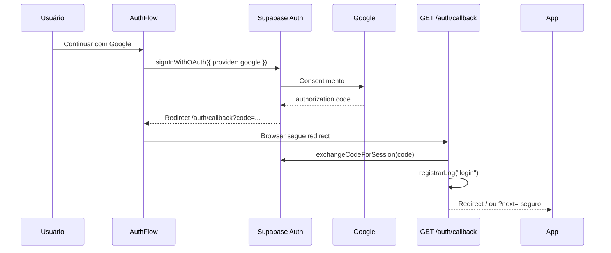
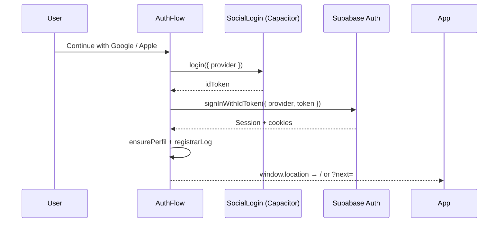
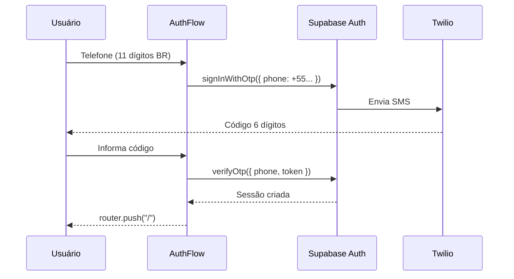
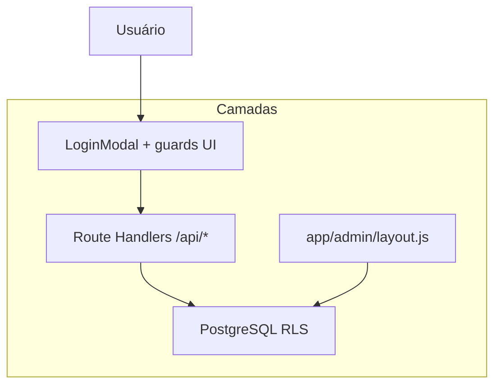

# Fluxo de autenticação

Autenticação e autorização no **Guia de Bolso**. Implementação delegada ao **Supabase Auth**; a aplicação não emite JWT próprio.

Visão de sistema: [`architecture.md`](./architecture.md#authentication-flow).

---

## Modelo de sessão

| Aspecto | Detalhe |
|---------|---------|
| Transporte | Cookies HTTP gerenciados por `@supabase/ssr` |
| Cliente browser | `lib/supabase/client.js` → `createBrowserClient` |
| Server (Route Handlers, layouts) | `lib/supabase/server.js` → `createServerClient` |
| Refresh | `middleware.js` chama `auth.getUser()` em cada request elegível |
| Expiração | Política padrão Supabase (refresh automático via middleware) |

**Não há** Context global React de auth — cada página/hook chama `getUser()` ou `onAuthStateChange` conforme necessário.

---

## Provedores habilitados

| Provedor | UI | Plataforma | Configuração |
|----------|-----|------------|--------------|
| **Google OAuth** | `AuthFlow` / `/login` | Web | Supabase Dashboard → Authentication → Google + redirect `/auth/callback` |
| **Google nativo** | `AuthFlow` | Capacitor Android / iOS | `@capgo/capacitor-social-login` + `signInWithIdToken` — see [Native login (Capacitor)](#native-login-capacitor) |
| **Apple nativo** | `AuthFlow` | Capacitor iOS only | Sign in with Apple + `signInWithIdToken` — see [Native login (Capacitor)](#native-login-capacitor) |
| **SMS OTP** | `AuthFlow` | All | Supabase + **Twilio** (6-digit OTP, `+55`) |

WhatsApp Auth is on the roadmap (Meta dependency).

**Key files:** `components/AuthFlow.js`, `lib/capacitorOAuth.js`, `lib/nativeGoogleAuth.js`, `lib/nativeAppleAuth.js`, `lib/nativeSocialLoginInit.js`.

---

## Fluxo Google OAuth (web)



**Arquivo:** `app/auth/callback/route.js`

- Usa `safeRedirectPath()` para `?next=` ([`lib/safeRedirectPath.js`](../lib/safeRedirectPath.js)) — evita open redirect.
- Registra evento em `logs` após sessão válida.

### URLs obrigatórias (Supabase)

| Ambiente | Site URL | Redirect URL |
|----------|----------|--------------|
| Local | `http://localhost:3000` | `http://localhost:3000/auth/callback` |
| Produção | `https://guiadebolso.app` | `.../auth/callback` |
| Preview Vercel | URL do preview | `https://<preview>/auth/callback` |

Detalhes: [`environment.md`](./environment.md), [`deployment.md`](./deployment.md#1-auth-url-configuration).

---

## Native login (Capacitor)

On native apps (Android/iOS), Google **does not** open an external browser: `@capgo/capacitor-social-login` returns an **ID token** and Supabase creates the session via `signInWithIdToken`.

| Platform | Google | Apple |
|----------|--------|-------|
| **Web** | OAuth redirect (`/auth/callback`) | Not available |
| **Android** | Native (`webClientId`) | Not available |
| **iOS** | Native (`iOSClientId` + `webClientId`) | Native (Sign in with Apple) |

### Native flow (Google and Apple)



**Web callback:** `app/auth/callback/route.js` — used **only** for browser Google OAuth. Native apps skip this route.

### Environment variables (Vercel)

| Variable | Where | Required on |
|----------|-------|-------------|
| `NEXT_PUBLIC_GOOGLE_WEB_CLIENT_ID` | Vercel + redeploy | Android native, iOS native, Supabase Google |
| `NEXT_PUBLIC_GOOGLE_IOS_CLIENT_ID` | Vercel + redeploy | **iOS native only** |

The **Web Client ID** matches Supabase → Authentication → Google. On iOS, the plugin also needs an **iOS Client ID** from Google Cloud Console (bundle `app.guiadebolso`).

After changing `NEXT_PUBLIC_*` on Vercel, **redeploy** — the Capacitor WebView loads `https://app.guiadebolso.app` and needs the updated bundle.

### Google Cloud Console (iOS)

1. [Google Cloud Console](https://console.cloud.google.com/apis/credentials) → **Credentials** → **Create credentials** → **OAuth client ID**.
2. Type: **iOS**.
3. **Bundle ID:** `app.guiadebolso` (same as `capacitor.config.ts`).
4. Copy the **Client ID** — format: `123456789012-abcdefghijklmnop.apps.googleusercontent.com`.

Use the same client in two places:

| Where | Value |
|-------|-------|
| Vercel | `NEXT_PUBLIC_GOOGLE_IOS_CLIENT_ID` = full Client ID above |
| `ios/GoogleAuth.xcconfig` | **Reversed client ID** (URL scheme) — see below |

### `ios/GoogleAuth.xcconfig` — Google URL scheme

Google Sign-In on iOS returns to the app via a **URL scheme**: the iOS Client ID **reversed** (reversed client ID).

**Edit:** `guia-de-bolso/ios/GoogleAuth.xcconfig`

**Derive reversed client ID:**

1. iOS Client ID example: `123456789012-abcdefghijklmnop.apps.googleusercontent.com`
2. Remove suffix `.apps.googleusercontent.com`
3. Prefix with `com.googleusercontent.apps.` → `com.googleusercontent.apps.123456789012-abcdefghijklmnop`

**File content:**

```xcconfig
GOOGLE_IOS_REVERSED_CLIENT_ID = com.googleusercontent.apps.123456789012-abcdefghijklmnop
```

No quotes, no extra spaces.

**Wiring:**

1. `ios/debug.xcconfig` → `#include "GoogleAuth.xcconfig"`
2. Xcode target **App** uses `debug.xcconfig` (Debug and Release)
3. `ios/App/App/Info.plist` → `CFBundleURLSchemes` → `$(GOOGLE_IOS_REVERSED_CLIENT_ID)`

**Code helper:** `getGoogleIOSUrlScheme()` in [`lib/nativeSocialLoginInit.js`](../lib/nativeSocialLoginInit.js).

**After editing:** save xcconfig → Xcode **Clean Build Folder** → test Google Sign-In on a **physical iPhone** (simulator may fail).

**Common failure:** reversed scheme does not match iOS Client ID → Google UI does not return to the app.

### Apple Sign-In (iOS)

Already in repo:

| Item | File |
|------|------|
| Sign in with Apple capability | `ios/App/App/App.entitlements` |
| Plugin enabled | `capacitor.config.ts` → `SocialLogin.providers.apple: true` |
| Bundle ID | `app.guiadebolso` |

**Supabase:** Authentication → Providers → **Apple** enabled (Services ID / `.p8` key per Supabase docs).

**UI:** Apple button in `AuthFlow` only when `canUseNativeAppleSignIn()` (Capacitor iOS). Hidden on web and Android.

**Code:** `lib/nativeAppleAuth.js` → `SocialLogin.login({ provider: "apple" })` → `supabase.auth.signInWithIdToken({ provider: "apple", token })`.

### Android (native Google)

- `SocialLogin.initialize({ google: { webClientId, mode: "online" } })` via `lib/nativeSocialLoginInit.js`
- Client ID = `NEXT_PUBLIC_GOOGLE_WEB_CLIENT_ID` (Web Client ID, **not** the Android OAuth client ID)
- Release keystore SHA-1 on the Android OAuth client (`app.guiadebolso`)

Errors: `formatNativeGoogleError()` in [`lib/nativeGoogleAuth.js`](../lib/nativeGoogleAuth.js).

### AppDelegate (iOS — Google URL callback)

`ios/App/App/AppDelegate.swift` handles Google URLs before Capacitor:

```swift
if CapAppAuthURLHandler.handle(url) { return true }
```

Implementation: `ios/App/CapApp-SPM/Sources/CapApp-SPM/CapApp-SPM.swift` (`GIDSignIn.sharedInstance.handle`).

---

## Fluxo SMS OTP



- Validação de formato no cliente (DDD + número).
- Reenvio com cooldown no UI (não substitui rate limit do Supabase).

---

## Perfil de aplicação (`perfis`)

Após `auth.users` criado:

| Campo | Uso |
|-------|-----|
| `id` | Igual a `auth.users.id` (UUID) |
| `nome`, `foto_url` | Perfil público |
| `role` | `usuario`, `admin`, `dev`, `estabelecimento` |
| `premium_ativo`, `premium_ate` | Guia Premium |
| `buscas_ia`, `roteiros_ia`, `uso_ia_mes` | Cotas IA (dia `YYYY-MM-DD` SP) |
| `maps_preferido` | App de navegação preferido |

Bootstrap: `lib/ensurePerfil.js` (primeiro acesso). Confirme triggers/policies no projeto Supabase.

---

## Autorização (após login)

Autenticação ≠ autorização. Camadas:



| Recurso | Regra |
|---------|--------|
| Ver lugares ativos | Público (RLS + `status = 'ativo'`) |
| Favoritos, avaliar | Login + RLS `auth.uid()` |
| Busca IA, roteiro IA | Login + cotas ([`api.md`](./api.md)) |
| Reviews públicas | Somente `status = 'aprovada'` |
| Admin CMS | `role` ∈ `admin`, `dev` (`canAccessAdmin`) |
| Admin sensitive (contracts, logs, taxonomia, …) | **`role = dev` only** (`canAccessDevAdmin`, `canAccessAdminSection`, `is_admin_only()` in SQL) |

### Guard admin (servidor + cliente)

1. **Servidor:** `app/admin/layout.js` — sem sessão → `/login?next=/admin`; sem role admin/dev → `/?admin=denied`.
2. **Cliente:** `AdminShell` + `useAdminAuth` — `canAccessAdminSection(role, pathname)` bloqueia rotas **dev-only** (`DEV_ONLY_ADMIN_PATHS` em `lib/adminRoles.js`) para role `admin`.
3. **API contratos:** `requireAdminOnlyApi()` — somente `dev` (403 para `admin`).

**Nunca** confiar só no cliente para operações sensíveis — RLS nas tabelas de escrita.

### Premium (uso IA)

| Tier | Buscas IA/dia | Roteiros IA/dia |
|------|---------------|-----------------|
| Gratuito (logado) | 5 | 2 |
| Premium | Ilimitado | Ilimitado |

Reset: meia-noite **America/Sao_Paulo**. Reserva atômica antes da Claude: RPC `increment_busca_ia`, `increment_roteiro_ia`. Estorno em falha da IA: `decrement_busca_ia`, `decrement_roteiro_ia`.

Cliente: `usePremiumUsage` + `GET /api/uso-premium` (servidor vence sobre `localStorage`).

Códigos API: `LOGIN_REQUIRED` (401), `LIMIT_REACHED` (403), `RATE_LIMITED` (429).

---

## Conteúdo restrito sem login

`LoginModal` (bottom sheet) em:

- Favoritar
- Enviar avaliação
- Busca IA e geração de roteiro IA

Rotas curadas (`/rotas`, detalhe de rota) permanecem **públicas** para leitura.

---

## Logout e exclusão de conta

- Logout: `supabase.auth.signOut()` na página de perfil (com confirmação).
- Exclusão de conta: fluxo na UI de perfil — ver implementação atual e policies Supabase antes de alterar.

Eventos analytics: `lib/logs.js` → tabela `logs`.

---

## Checklist de debug auth

| Sintoma | Verificar |
|---------|-----------|
| Loop no login | Redirect URLs no Supabase |
| Sessão some no refresh | `middleware.js` matcher; cookies bloqueados |
| Admin nega acesso | `perfis.role`, layout server |
| IA sempre 401 | Cookies em domínio preview vs produção |
| Cota não zera | Fuso `America/Sao_Paulo`, RPC e `uso_ia_mes` |
| Google no app iOS não volta | `ios/GoogleAuth.xcconfig` (reversed client ID) + `NEXT_PUBLIC_GOOGLE_IOS_CLIENT_ID` |
| Google no app Android falha | `NEXT_PUBLIC_GOOGLE_WEB_CLIENT_ID`, SHA-1 no GCP, test users OAuth |
| Apple no app iOS falha | Provider Apple no Supabase, entitlements, teste em device físico |
| Botão Apple não aparece | Esperado fora do iOS nativo; no iPhone, confirmar build Capacitor |

---

## Referências

- [`data-flows.md`](./data-flows.md) — writes autenticados
- [`security-rls.md`](./security-rls.md) — políticas RLS
- [`api.md`](./api.md) — endpoints que exigem sessão
