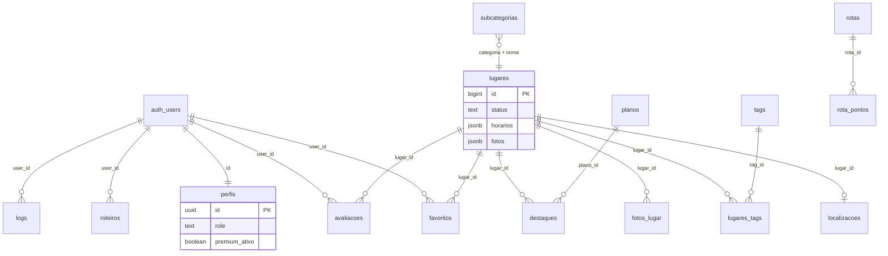

# Database

> **Índice:** [docs/README.md](./README.md) · **Fluxos:** [data-flows.md](./data-flows.md) · **Auth/RLS:** [authentication.md](./authentication.md), [security-rls.md](./security-rls.md)  
> **Architecture & evolution:** modeling, normalization, performance, roadmap, and index strategy → [**DATABASE_ARCHITECTURE.md**](./DATABASE_ARCHITECTURE.md).  
> **Apply order & migration practices:** [**migrations.md**](./migrations.md#manifest).

The application database runs on **Supabase (PostgreSQL)** in region **`us-west-2`**. **Row Level Security (RLS)** is required on production tables; many policies are versioned in [`/supabase`](../supabase) — compare the Dashboard with [RLS](#row-level-security-rls) and [`security-rls.md`](./security-rls.md). Schema changes are applied manually in the **Supabase SQL Editor** (CLI optional; see [migrations.md](./migrations.md)).

**Auth users** live in Supabase’s `auth.users` schema. App data lives in `public`.

**Primary key type:** `lugares.id` is **`bigint`** in production. All `lugar_id` foreign keys and RPCs must use `bigint`, not `uuid`.

---

## Entity relationship diagram



**Note:** The `categorias` table described in early project docs is **not queried by the app**. Categories are fixed in UI code; `subcategorias` links to category **by name** (`subcategorias.categoria` text), not by FK.

---

## Tables and columns

Columns marked *(migration)* come from files in `/supabase`. Others are inferred from application usage and may exist in the live project without a repo migration file.

### `auth.users` (Supabase managed)

Not in `public`. Referenced by `perfis.id`, `favoritos.user_id`, `avaliacoes.user_id`, `roteiros.user_id`, `logs.user_id`.

| Column | Description |
|--------|-------------|
| `id` | UUID primary key — same as `perfis.id` |
| `email`, `phone` | Login identifiers |
| `raw_user_meta_data` | OAuth name, avatar hints |

---

### `perfis`

One row per registered user. Extends auth with app profile, admin role, and AI/premium usage.

| Column | Type | Description |
|--------|------|-------------|
| `id` | `uuid` PK | = `auth.users.id` |
| `nome` | `text` | Display name |
| `foto_url` | `text` | Avatar public URL (Storage `imagens` bucket) |
| `role` | `text` | `dev`, `admin`, `usuario`, `estabelecimento` — see `perfis_role_check.sql` |
| `maps_preferido` | `text` | `google`, `apple`, `waze` (optional; app also uses `localStorage`) |
| `created_at` | `timestamptz` | Profile creation |
| `premium_ativo` | `boolean` | Subscription flag *(migration: `premium_usuario.sql`)* |
| `premium_ate` | `timestamptz` | Expiry; `NULL` = no end date *(migration)* |
| `uso_ia_mes` | `text` | **Day bucket** `YYYY-MM-DD` (America/Sao_Paulo); column name is legacy. `getEffectiveUsageCounters()` / `isSameUsageDay()` count usage only when the key equals today (SP). Legacy `YYYY-MM` or stale days show **0** on read and are realigned via `alignPerfilUsageToDay()` on `GET /api/uso-premium` and before increment. RPC `increment_*_ia` uses exact `YYYY-MM-DD` only. |
| `buscas_ia` | `integer` | AI searches used **today** *(migration)* |
| `roteiros_ia` | `integer` | AI itineraries used **today** *(migration)* |

**Free tier limits** (enforced in app + RPC): **5 searches/day**, **2 roteiros/day**; counters reset at **midnight** (SP). Premium: unlimited (`lib/premium.js`). See `supabase/premium_uso_diario.sql` (column comment).

---

### `lugares`

Core content: beaches, restaurants, trails, services, etc.

| Column | Type | Description |
|--------|------|-------------|
| `id` | `bigint` PK | Serial/numeric id (not uuid in production) |
| `nome` | `text` | Display name |
| `descricao` | `text` | Short description |
| `descricao_longa` | `text` | Long “about” copy |
| `categoria` | `text` | Natureza, Gastronomia, Noite, Serviços, Hospedagem, Cultura, Aventura, Bem-estar, Compras |
| `subcategoria` | `text` | e.g. Praias, Restaurantes — must match `subcategorias.nome` for same `categoria` |
| `status` | `text` | `ativo`, `desativado`, `em_analise` — public app only reads `ativo` |
| `desativado_em` | `timestamptz` | Preenchido ao desativar; após **30 dias** o cron exclui o registro definitivamente *(migration: `lugares_purge_inativos.sql`)* |
| `horarios` | `jsonb` | Weekly hours: keys `dom`…`sab`, values `fechado`, `24h`, `HH:MM-HH:MM`, multiple intervals comma-separated (`11:00-15:00,18:00-23:00`), or overnight (`18:30-00:00`, `22:00-02:00` — when `fim <= inicio`, closing is on the next calendar day) |
| `telefone` | `text` | Phone |
| `instagram` | `text` | Handle or URL |
| `cardapio_url` | `text` | Menu link |
| `site_url` | `text` | Website |
| `endereco` | `text` | *(legacy — may be absent in some DBs)* Admin saves address in `localizacoes` only |
| `mostrar_endereco` | `boolean` | Show address/map block on place detail *(migration: `lugares_visibilidade.sql`)* |
| `mostrar_horarios` | `boolean` | Show hours UI and open/closed badges when `horarios` is set *(migration)* |
| `imagem_url` | `text` | Legacy cover; first photo synced here on save |
| `fotos` | `jsonb` | Array of public image URLs *(migration: `fotos_migration.sql`)* |
| `destaque` | `boolean` | Legacy highlight flag on row (unused in app) |
| `eh_parceiro` | `boolean` NOT NULL DEFAULT false | Plano Parceiro do Guia (R$ 199) — carrossel e badge *(migration: `lugares_parceiro_curadoria.sql`)* |
| `conteudo_curadoria` | `boolean` NOT NULL DEFAULT false | Conteúdo autoral curado pela equipe — hero e Em alta *(migration)* |
| `distancia` | `text` | Legacy static label; app prefers `localizacoes` + GPS (`distancia_calculada`) |
| `rating_medio` | `numeric` | *(optional, not in repo migrations)* — if present, `PlaceCard` / `EmAltaCard` show stars without extra queries |
| `media_avaliacoes` | `numeric` | *(optional alias)* — same client read path as `rating_medio` |
| `created_at` | `timestamptz` | |
| `slug` | `text` | Unique short URL segment for `/q/{slug}` (eligible establishments only; null for Natureza/Aventura) *(migration: `lugares_qr_slug.sql`)* |
| `video_url` | `text` | Public URL of one optional place video in Storage `lugares-fotos/{id}/videos/` *(migration: `lugares_video.sql`)* |
| `tem_video` | `boolean` NOT NULL DEFAULT false | Enables video upload in admin outside Natureza/Aventura *(migration)* |

**Place video limits** (enforced in `lib/videoUpload.js` on admin upload; no server transcode):

| Rule | Value |
|------|--------|
| Max duration | 60 seconds |
| Max file size | 25 MB |
| Formats | MP4 (H.264), WebM |
| Count | 1 video per place |

Admin compresses before upload (client validates only). Detail page: native `<video controls playsInline>` in section **“Veja o lugar”**, below photo gallery, hidden when `video_url` is null.

**`horarios` runtime:** parsed in `lib/horarios.js` (`parseHorarioDia`, `getStatusFuncionamento`, overnight carry-over, `America/Sao_Paulo`). Tests: `node lib/horarios.test.js`.

Until an aggregate column or view exists, cards omit the rating chip; detail page still loads approved `avaliacoes` for the full list.

---

### `localizacoes`

Structured address and coordinates (1:1 with `lugares`).

| Column | Type | Description |
|--------|------|-------------|
| `lugar_id` | `bigint` PK/FK | → `lugares.id`, upsert `onConflict: lugar_id` |
| `rua`, `numero`, `bairro`, `cidade`, `estado`, `cep`, `pais` | `text` | Address parts |
| `endereco_completo` | `text` | Full formatted address |
| `latitude`, `longitude` | `float` | Used for distance, maps, static map preview |

---

### `fotos_lugar`

Optional normalized photo gallery (legacy path; app merges with `lugares.fotos` JSON).

| Column | Type | Description |
|--------|------|-------------|
| `id` | (serial/uuid) | PK |
| `lugar_id` | `bigint` FK | → `lugares` |
| `url` / `imagem_url` / `foto_url` | `text` | App reads any of these field names |

---

### `tags`

Controlled vocabulary for place attributes (pet friendly, vista mar, etc.).

| Column | Type | Description |
|--------|------|-------------|
| `id` | `integer` PK | |
| `nome` | `text` | Label |
| `categorias` | `jsonb` | Array of category names (derivado das subcategorias ou legado) *(migration: `tags_categorias.sql`)* |
| `subcategorias` | `jsonb` | Array `[{ "categoria": "Natureza", "nome": "Praias" }, …]` — onde a tag aparece no admin de locais *(migration: `tags_subcategorias.sql`)* |
| `aplica_em_rotas` | `boolean` | When true, tag appears in admin route form *(migration: `rotas_taxonomia.sql`)* |

Admin limits **5 tags per place**. Filtering: `lib/tags.js` (`filterTagsBySubcategoria`; fallback `filterTagsByCategoria` se `subcategorias` vazio).

---

### `lugares_tags`

Join table **many-to-many** `lugares` ↔ `tags`.

| Column | Type | Description |
|--------|------|-------------|
| `lugar_id` | `bigint` FK | |
| `tag_id` | `integer` FK | → `tags.id` |

Admin replaces all rows on save: `delete` by `lugar_id`, then `insert` batch.

---

### `subcategorias`

Lookup for admin and category pages. **Not** FK-linked to `lugares`; matched by `lugares.categoria` + `lugares.subcategoria` text.

| Column | Type | Description |
|--------|------|-------------|
| `id` | (serial/uuid) | PK |
| `categoria` | `text` | Parent category name |
| `nome` | `text` | Broad place type only (e.g. Praias, Trilhas — not Surfe/pôr do sol; those are **tags**) |
| `icone` | `text` | Optional emoji shown in admin and category chips |

Queried with `.eq("categoria", form.categoria)` in admin and `.eq("categoria", slug)` on `/categoria/[slug]`.

---

### `favoritos`

User bookmarks.

| Column | Type | Description |
|--------|------|-------------|
| `id` | (serial/uuid) | PK |
| `user_id` | `uuid` FK | → `auth.users` |
| `lugar_id` | `bigint` FK | → `lugares` |
| `created_at` | `timestamptz` | |

Unique constraint on `(user_id, lugar_id)` — see `db_indexes.sql` (`idx_favoritos_user_lugar_unique`).

---

### `rotas_favoritas`

User bookmarks for **curated routes** (`rotas`), not `roteiros` (IA). Migration: `supabase/rotas_favoritas.sql`.

| Column | Type | Description |
|--------|------|-------------|
| `id` | `uuid` | PK |
| `user_id` | `uuid` FK | → `auth.users` |
| `rota_id` | `uuid` FK | → `rotas` |
| `created_at` | `timestamptz` | |

Unique `(user_id, rota_id)`. RLS: authenticated users CRUD own rows. Listing in `/favoritos` is not implemented yet.

---

### `avaliacoes`

User reviews with moderation.

| Column | Type | Description |
|--------|------|-------------|
| `id` | `uuid` | PK |
| `lugar_id` | `bigint` FK | → `lugares` |
| `user_id` | `uuid` FK | |
| `nota` | `integer` | 1–5 |
| `comentario` | `text` | Optional |
| `aspectos` | `jsonb` | Selected aspect labels from structured form (default `[]`) |
| `sugestao_ia` | `text` | Claude pre-moderation hint (`aprovar` / `rejeitar` / `revisar` + reason) |
| `status` | `text` | `pendente`, `aprovada`, `rejeitada` |
| `created_at` | `timestamptz` | |

Public reads: `status = 'aprovada'`. Inserts default to `pendente`. After insert, client calls `POST /api/avaliacoes/analisar`. Admin approves/rejects. Migration: `supabase/avaliacoes_moderacao.sql`.

Some selects join `profiles:user_id(...)` (Supabase view); fallback select uses `*` only.

---

### `feedback`

User suggestions, questions, and problem reports (voluntary).

| Column | Type | Description |
|--------|------|-------------|
| `id` | `uuid` | PK |
| `user_id` | `uuid` FK → `auth.users` | Nullable (guest via API) |
| `tipo` | `text` | `sugestao`, `duvida`, `critica`, `elogio`, `erro`, `outro` |
| `status` | `text` | `novo`, `em_analise`, `respondido`, `arquivado` (default `novo`) |
| `assunto` | `text` | Optional (~120 chars) |
| `mensagem` | `text` | Required (min 10 chars in API) |
| `email_contato` | `text` | Optional |
| `nome_contato` | `text` | Optional |
| `pagina_origem` | `text` | e.g. `/`, `/perfil`, `/lugares/uuid` |
| `contexto_tecnico` | `jsonb` | Optional (route, code, userAgent, timestamp) |
| `admin_notas` | `text` | Internal admin notes |
| `created_at` / `updated_at` | `timestamptz` | |

**Indexes:** `status`, `tipo`, `created_at DESC`, `user_id`.

**RLS** (migration `supabase/feedback.sql`):

- **INSERT:** authenticated users with `user_id = auth.uid()`; guests insert only via `POST /api/feedback` (service role).
- **SELECT / UPDATE:** `perfis.role` in `admin`, `dev` (same pattern as `avaliacoes` / `logs`).

---

### `rotas`

Admin-managed curated routes (trails, city walks). **Distinct from** AI `roteiros`.

| Column | Type | Description |
|--------|------|-------------|
| `id` | `uuid` | PK |
| `nome` | `text` | Display title |
| `descricao` | `text` | |
| `cidade` | `text` | e.g. Imbituba |
| `categoria` | `text` | Tipo de experiência — valores fixos em `lib/rotas.js` (Trilha, Passeio urbano, …) |
| `dificuldade` | `text` | Fácil, Médio, Difícil |
| `duracao_minutos` | `integer` | |
| `distancia_km` | `numeric` | |
| `destaque` | `boolean` | Only one featured at a time (admin clears others) |
| `ativa` | `boolean` | Soft visibility |
| `foto_capa` / `imagem_capa` | `text` | Legacy cover URLs |
| `fotos` | `jsonb` | Gallery URLs *(migration: `fotos_migration.sql`)* |
| `created_at` | `timestamptz` | |

**Tags:** junction `rotas_tags` → `tags` (subset com `tags.aplica_em_rotas = true`). Admin: máx. 5 tags; replace on save.

---

### `rotas_tags`

Join table **many-to-many** `rotas` ↔ `tags` (subset de tags aplicáveis a rotas).

| Column | Type | Description |
|--------|------|-------------|
| `id` | `uuid` | PK |
| `rota_id` | `uuid` FK | → `rotas.id` |
| `tag_id` | `integer` FK | → `tags.id` |

Admin replaces all rows on save: `delete` by `rota_id`, then `insert` batch. Filtering: `lib/tags.js` (`filterTagsParaRotas`, `getTagsFromRota`).

---

### `rota_pontos`

Ordered steps for a `rotas` row.

| Column | Type | Description |
|--------|------|-------------|
| `id` | (serial/uuid) | PK |
| `rota_id` | `uuid` FK | → `rotas` |
| `ordem` | `integer` | Step sequence |
| `nome` | `text` | Step title |
| `descricao` | `text` | Step instruction *(legado; prefer `rota_ponto_detalhes`)* |
| `lugar_id` | `bigint` FK (nullable) | *(legado, não usado no app)* |

Detalhes ordenados em **`rota_ponto_detalhes`** (várias descrições por ponto). Admin: delete pontos da rota (cascade) e re-insert.

---

### `rota_ponto_detalhes`

Ordered description lines for each `rota_pontos` row.

| Column | Type | Description |
|--------|------|-------------|
| `id` | `uuid` | PK |
| `ponto_id` | `uuid` FK | → `rota_pontos.id` |
| `ordem` | `integer` | Line sequence |
| `texto` | `text` | Description line |

*(migration: `rota_ponto_detalhes.sql`)*

---

### `rota_dicas`

Ordered tips for a `rotas` row, shown at the bottom of `/rotas/[id]`.

| Column | Type | Description |
|--------|------|-------------|
| `id` | `uuid` | PK |
| `rota_id` | `uuid` FK | → `rotas` |
| `ordem` | `integer` | Tip sequence |
| `texto` | `text` | Tip content |
| `created_at` | `timestamptz` | |

Admin: delete all tips for route, re-insert on save *(migration: `rota_dicas.sql`)*.

---

### `rotas_localizacoes`

Structured address and coordinates (1:1 with `rotas`). Used by **Abrir no Maps** on `/rotas/[id]`; endereço **não** é exibido no app.

| Column | Type | Description |
|--------|------|-------------|
| `rota_id` | `uuid` PK/FK | → `rotas.id`, upsert `onConflict: rota_id` |
| `rua`, `numero`, `bairro`, `cidade`, `estado`, `cep`, `pais` | `text` | Address parts |
| `endereco_completo` | `text` | Full formatted address |
| `latitude`, `longitude` | `float` | Map pin / navigation target |

*(migration: `rotas_localizacoes.sql`)*

---

### `roteiros`

User-saved **AI-generated** trip plans (not admin `rotas`).

| Column | Type | Description |
|--------|------|-------------|
| `id` | `uuid` | PK |
| `user_id` | `uuid` FK | Owner |
| `titulo` | `text` | |
| `dias` | `integer` | Trip length in days (1–3; 4 = “4+ dias” in UI); UI labels parsed via `parseDiasViagem()` |
| `perfil` | `text` | Traveler profile |
| `interesses` | `jsonb` / array | Interest tags |
| `conteudo` | `text` | Markdown/body from Claude |
| `created_at` | `timestamptz` | |

Written by `POST /api/roteiro/salvar`; listed on `/rotas` when logged in.

---

### `planos`

Commercial highlight **pricing tiers** (Básico, Padrão, Premium).

| Column | Type | Description |
|--------|------|-------------|
| `id` | (serial) | PK — app uses numeric ids in admin forms |
| `nome` | `text` | Plan name — app V1 uses single row **Parceiro** (R$ 199/mês) via `lib/planoComercial.js` |
| `frequencia` | `text` | e.g. `mensal` |
| `preco` | `numeric` | BRL |

---

### `destaques`

Scheduled promotional slots linking a place to a plan.

| Column | Type | Description |
|--------|------|-------------|
| `id` | (serial) | PK |
| `lugar_id` | `bigint` FK | → `lugares` |
| `plano_id` | FK | → `planos.id` |
| `data_inicio`, `data_fim` | `date` | Active window |
| `ativo` | `boolean` | Manual on/off |

---

### `logs`

Product analytics and audit trail.

| Column | Type | Description |
|--------|------|-------------|
| `id` | (serial/uuid) | PK |
| `user_id` | `uuid` FK | → `perfis.id` ON DELETE SET NULL *(migration: `logs_policies.sql`)* |
| `user_email` | `text` | Denormalized |
| `user_nome` | `text` | Denormalized |
| `acao` | `text` | e.g. `login`, `favoritou`, `ir_agora`, `visualizou_lugar`, `escaneou_qr`, `acessou_app` |
| `detalhes` | `jsonb` | Context (place name, maps app, page, etc.) |
| `created_at` | `timestamptz` | |

Inserted via `lib/logs.js` → `registrarLog()`.

---

### `logs_ia`

Observability e custo por chamada da Anthropic API.

| Column | Type | Description |
|--------|------|-------------|
| `id` | `uuid`/`bigint` | PK (dependendo do schema aplicado) |
| `created_at` | `timestamptz` | Timestamp do log |
| `feature` | `text` | `busca`, `roteiro`, `moderacao` |
| `user_id` | `uuid` FK | Usuário associado (nullable) |
| `input_tokens` | `integer` | Tokens de entrada |
| `output_tokens` | `integer` | Tokens de saída |
| `cache_creation_tokens` | `integer` | Tokens gastos criando cache |
| `cache_read_tokens` | `integer` | Tokens lidos do cache |
| `custo_usd` | `numeric` | Custo calculado por chamada |
| `latencia_ms` | `integer` | Latência total da chamada |
| `sucesso` | `boolean` | `true` para respostas válidas |
| `erro` | `text` | Mensagem resumida de erro quando falha |

Inserção via `lib/logIA.js` (`calcularCusto` + `logIA`) nas rotas `POST /api/buscar`, `POST /api/roteiro` e `POST /api/avaliacoes/analisar`.

---

### `despesas_config`

Configuração global do módulo de despesas operacionais (admin).

| Column | Type | Description |
|--------|------|-------------|
| `id` | `smallint` PK | Sempre `1` (single row) |
| `taxa_cambio_usd_brl` | `numeric(8,4)` | Taxa USD→BRL padrão (default `5.90`) |
| `updated_at` | `timestamptz` | Última alteração |

---

### `despesas_operacionais`

Catálogo manual de despesas fixas/recorrentes da stack (Vercel, Supabase, domínio, etc.). CRUD em `/admin/despesas`.

| Column | Type | Description |
|--------|------|-------------|
| `id` | `uuid` PK | |
| `nome_plataforma` | `text` | Nome do serviço |
| `categoria` | `text` | `infra`, `ia`, `auth`, `maps`, `lojas`, `ferramentas`, `dominio`, `marketing`, `outros` |
| `periodicidade` | `text` | `mensal`, `trimestral`, `semestral`, `anual`, `unico` |
| `valor` | `numeric(12,4)` | Valor na moeda informada |
| `moeda` | `text` | `USD` ou `BRL` |
| `ativo` | `boolean` | Despesa vigente |
| `data_inicio` | `date` | Início da cobrança |
| `data_fim` | `date` | Cancelamento (nullable) |
| `dia_vencimento` | `smallint` | Dia do mês (1–28, nullable) |
| `notas` | `text` | Observações |
| `url_referencia` | `text` | Link do painel/fatura |
| `taxa_cambio` | `numeric(8,4)` | Override USD→BRL por item (nullable) |
| `created_at`, `updated_at` | `timestamptz` | Auditoria |

Migration: [`despesas_operacionais.sql`](../supabase/despesas_operacionais.sql). Lógica: `lib/adminDespesas.js`.

---

### `despesas_lancamentos`

Histórico de pagamentos reais vinculados a `despesas_operacionais`.

| Column | Type | Description |
|--------|------|-------------|
| `id` | `uuid` PK | |
| `despesa_id` | `uuid` FK | → `despesas_operacionais.id` ON DELETE CASCADE |
| `valor` | `numeric(12,4)` | Valor pago |
| `moeda` | `text` | `USD` ou `BRL` |
| `data_pagamento` | `date` | Data efetiva |
| `competencia` | `text` | Mês de referência (`YYYY-MM`, nullable) |
| `notas` | `text` | |
| `created_at` | `timestamptz` | |

---

## Relationships summary

| From | To | Cardinality | Join / notes |
|------|-----|-------------|--------------|
| `perfis` | `auth.users` | 1:1 | Same `id` |
| `localizacoes` | `lugares` | 1:1 | `lugar_id` |
| `lugares_tags` | `lugares`, `tags` | N:M | `lugar_id`, `tag_id` |
| `favoritos` | `lugares`, user | N:1 | `user_id`, `lugar_id` |
| `avaliacoes` | `lugares`, user | N:1 | Moderation on `status` |
| `destaques` | `lugares`, `planos` | N:1 each | Date range + `ativo` |
| `rotas_tags` | `rotas`, `tags` | N:M | `rota_id`, `tag_id` |
| `rota_pontos` | `rotas` | N:1 | Ordered by `ordem` |
| `rota_ponto_detalhes` | `rota_pontos` | N:1 | Ordered description lines |
| `rota_dicas` | `rotas` | N:1 | Ordered tips by `ordem` |
| `rotas_localizacoes` | `rotas` | 1:1 | `rota_id`; maps/navigation only |
| `roteiros` | user | N:1 | Private to owner |
| `logs` | `perfis` | N:1 | Optional `user_id` |
| `logs_ia` | `perfis` | N:1 | Optional `user_id`, custo/latência IA |
| `despesas_lancamentos` | `despesas_operacionais` | N:1 | Pagamentos reais por despesa |
| `subcategorias` | `lugares` | Logical | Text match on `categoria` + `nome`, not FK |

### Common Supabase select patterns

```text
*, localizacoes(*), lugares_tags(tags(*))     -- home, search, category, popular places
*, lugares(nome)                              -- admin reviews, destaques
*, planos(nome, frequencia, preco)            -- destaques list
id,lugar_id,lugares!inner(*)                  -- favoritos with place embed
*, rotas_tags(tags(*))                        -- routes list/detail
*, lugares(id, nome)                          -- route steps with optional place link
```

---

## Row Level Security (RLS)

RLS policies for **`rotas`** and related tables are in [`rotas_policies.sql`](../supabase/rotas_policies.sql) (`is_admin_user()` helper; public read active routes; admin/dev write).

### Documented policies in repo

| Object | Policy | File | Effect |
|--------|--------|------|--------|
| `perfis` | `perfis_select_own` | `perfis_premium_policies.sql` | `SELECT` where `auth.uid() = id` |
| `perfis` | `perfis_insert_own` | same | `INSERT` own row |
| `perfis` | `perfis_update_own` | same | `UPDATE` own row |
| `logs` | `Admin lê logs` | `logs_policies.sql` | `SELECT` for `admin`/`dev` via `is_admin_or_dev()` |
| `lugares` | Public read active + admin write | `lugares_public_read.sql`, `lugares_admin_write.sql` | Active places for anon; admin CRUD |
| `localizacoes`, `tags`, `lugares_tags` | Public read | `lugares_related_public_read.sql` | Joined to active `lugares` |
| `avaliacoes` | Insert/select/update IA | `avaliacoes_moderacao.sql` | Approved public; own pending |
| `feedback` | User insert / admin read | `feedback.sql` | Support tickets |
| `roteiros` | Users CRUD own rows | `roteiros_policies.sql` | AI saved trips |
| `rotas` + children | Public read / admin write | `rotas_policies.sql` | Re-run after `rota_dicas.sql` / `rotas_taxonomia.sql` |
| `rotas_favoritas` | Own rows | `rotas_favoritas.sql` | Route bookmarks |
| `storage.objects` | lugares-fotos / rotas-fotos read | `fotos_migration.sql` | Public read |
| `storage.objects` | lugares-fotos / rotas-fotos write | `storage_admin_fotos.sql` | Admin-only upload/update/delete |
| `storage.objects` | `imagens` avatars | `storage-policies.sql` | Insert/update only under `avatars/{user_id}/` |
| `storage.objects` | legacy avatar bucket | `storage_avatar_legacy_bucket.sql` | Same path on **Guia de Bolso - Imagens** (production) |

### Expected policies (inferred from app)

| Table | `anon` / public | `authenticated` | Admin (`role` in `admin`, `dev`) |
|-------|-----------------|-----------------|-------------------------------------|
| `lugares` | `SELECT` where `status = 'ativo'` | Same | `INSERT`/`UPDATE`/`DELETE` all statuses |
| `localizacoes`, `fotos_lugar`, `tags`, `subcategorias` | `SELECT` | `SELECT` | Full write |
| `lugares_tags`, `rotas_tags` | `SELECT` | `SELECT` | Write via admin session |
| `favoritos` | — | `SELECT`/`INSERT`/`DELETE` own `user_id` | — |
| `avaliacoes` | `SELECT` where `status = 'aprovada'` | `INSERT` own; `SELECT` own pending | `SELECT` all; `UPDATE` status |
| `roteiros` | — | CRUD own `user_id` | — |
| `rotas`, `rota_pontos`, `rota_dicas` | `SELECT` active/public | `SELECT` | Full write |
| `destaques`, `planos` | `SELECT` active (if exposed) | — | Full write |
| `perfis` | — | Own row; admin may need broader `SELECT` for `/admin/usuarios` | Update any `role` |
| `logs` | — | `INSERT` (app) | `SELECT` (dashboard) |

**Admin access:** The app checks `perfis.role` in the client (`useAdminAuth`). RLS must still allow admin writes on content tables; otherwise admin CRUD fails even with UI access.

**Premium counters:** Reserva atômica via **`increment_busca_ia`** / **`increment_roteiro_ia`** antes da Claude; estorno em falha via **`decrement_busca_ia`** / **`decrement_roteiro_ia`**. Fallback: update direto em `perfis` em `lib/premiumServer.js` quando RPC ausente.

---

## SQL functions (RPC)

| Function | Parameter | Returns | Purpose | File |
|----------|-----------|---------|---------|------|
| `increment_busca_ia` | `p_user_id uuid` | `jsonb` | Auth check, **daily** reset (`YYYY-MM-DD`), reserva 1 busca (limit **5**/day), premium bypass | `increment_uso_ia.sql` |
| `increment_roteiro_ia` | `p_user_id uuid` | `jsonb` | Same for roteiros (limit 2/day); returns `resets_at` (next midnight SP) in `usage` | `increment_uso_ia.sql` |
| `decrement_busca_ia` | `p_user_id uuid` | `jsonb` | Estorna 1 busca após falha da Claude (não premium) | `increment_uso_ia.sql` |
| `decrement_roteiro_ia` | `p_user_id uuid` | `jsonb` | Estorna 1 roteiro após falha da Claude (não premium) | `increment_uso_ia.sql` |
| `lugares_populares_ids` | `p_limit int` | `(lugar_id bigint, favoritos_count bigint)` | Top places by favorite count; use **`lugares_populares_rpc_fix.sql`** if return type was `uuid` | `lugares_populares_rpc.sql` |

**Return payload (conceptual):**

```json
{
  "allowed": true,
  "code": "OK",
  "message": "...",
  "usage": {
    "premium": false,
    "day": "2026-05-19",
    "month": "2026-05-19",
    "resets_at": "2026-05-20T03:00:00.000Z",
    "buscas": { "used": 1, "limit": 5, "remaining": 4 },
    "roteiros": { "used": 0, "limit": 2, "remaining": 2 }
  }
}
```

Codes: `LOGIN_REQUIRED`, `LIMIT_REACHED`, `OK`.

Granted to `authenticated`. Called from `lib/premiumServer.js` via `supabase.rpc()`.

---

## Storage buckets

| Bucket | Path pattern | Policies | Used by |
|--------|--------------|----------|---------|
| `lugares-fotos` | `{lugar_id}/{timestamp}-{name}.jpg` | `fotos_migration.sql` | Admin place photos |
| `rotas-fotos` | `{rota_id}/...` | `fotos_migration.sql` | Admin route photos |
| **Guia de Bolso - Imagens** | `avatars/{user_id}/avatar.jpg` | `storage_avatar_legacy_bucket.sql` (production) | Profile avatar upload (`POST /api/perfil/avatar`) |
| `imagens` | `avatars/{user_id}/avatar.jpg` | `storage-policies.sql` | Profile avatars (fallback bucket name) |

Production may use only the legacy bucket above; `lib/avatarStorage.js` tries **Guia de Bolso - Imagens** first, then `imagens`.

---

## Migration checklist (new environment)

**Authoritative ordered manifest** (base schema → premium → RLS → content → routes → security P0 → indexes/RPC): see [**migrations.md → Manifest**](./migrations.md#manifest).

Quick summary for existing projects that already have base tables:

1. Premium + RPC: `premium_usuario.sql`, `increment_uso_ia.sql`
2. Perfis RLS + guards: `perfis_rls_fix.sql`, `perfis_premium_policies.sql`, `perfis_privileged_guard.sql`, `perfis_role_check.sql`
3. Content & taxonomy: `tags_categorias.sql`, `fotos_migration.sql`, `lugares_visibilidade.sql`, `taxonomia_lugares_cleanup.sql`, `lugares_qr_slug.sql`
4. Routes: `rotas_taxonomia.sql`, `rota_dicas.sql`, **`rotas_policies.sql`** (re-run after route child tables), `rotas_localizacoes.sql`, `rota_ponto_detalhes.sql`, `rotas_favoritas.sql`
5. Security P0: `lugares_public_read.sql`, `lugares_related_public_read.sql`, `lugares_admin_write.sql`, `logs_policies.sql`, `storage_admin_fotos.sql`, **`storage_avatar_legacy_bucket.sql`** (if avatars use legacy bucket)
6. Performance: `db_indexes.sql`, `db_indexes_phase2.sql`, `lugares_populares_rpc.sql`, **`lugares_populares_rpc_fix.sql`**

---

## Main queries and use cases

### Consumer — home (`app/page.js`)

| Use case | Query |
|----------|--------|
| Active places | `GET /api/lugares` → active `lugares` with joins — `enrichLugaresFlags` (`lib/lugarBadges.js`) |
| Hero (“Sugestão do momento”) | `GET /api/rotas` → `pickHeroRotaCiclo` (`lib/homeSelection.js`) — round-robin diário, rotas ativas com capa |
| “Em alta hoje” | `conteudo_curadoria = true` → `pickEmAltaCuradoria` — daily deterministic shuffle (not `lugares_populares`) |
| Parceiros carousel | `eh_parceiro = true` → `pickParceirosPorCategoria` — one per category, `weeklySeed` |
| “Perto de você” | Active `lugares` via API `.limit(20)`, exclude **hero id only**, `.slice(0, 6)`, sort by GPS — phase 2 |
| Browse “Populares” (search overlay) | `fetchLugaresPopulares` (`lib/lugaresPopulares.js`) — unchanged |
| Favorites on home | `favoritos` `.select("lugar_id")` `.eq("user_id", user.id)` |
| AI search | **Not SQL** — `POST /api/buscar` loads catalog server-side |

### Consumer — place detail (`app/lugares/[id]/page.js`)

| Use case | Query |
|----------|--------|
| Place | `lugares` `.select("*")` `.eq("id")` `.eq("status","ativo")` |
| View log (logged-in) | `registrarLog(..., "visualizou_lugar", { lugar_id, lugar_nome })` on mount |
| Photos | `fotos_lugar` by `lugar_id`; fallback `lugares.fotos` jsonb |
| Location | `localizacoes` `.maybeSingle()` |
| Tags | `lugares_tags` `.select("tags(*)")` |
| Reviews | `avaliacoes` `.eq("status","aprovada")` `.order("created_at")` |
| Favorite / review state | `favoritos` / `avaliacoes` by `user_id` + `lugar_id` |
| Submit review | `avaliacoes` `.insert({ status: "pendente", aspectos })` → `POST /api/avaliacoes/analisar` |

### Consumer — favorites (`app/favoritos/page.js`)

| Use case | Query |
|----------|--------|
| List with places | `favoritos` `.select("id,lugar_id,lugares!inner(*)")` or separate `lugares` `.in("id", ids)` |
| Remove | `favoritos` `.delete()` `.eq("user_id")` `.eq("lugar_id")` |

### Consumer — categories

| Use case | Query |
|----------|--------|
| Category grid counts | `lugares` `.select("categoria")` `.eq("status","ativo")` — aggregate counts in JS (`app/categorias/page.js`) |
| Filtered list | `lugares` + joins `.eq("categoria", ...)` `.eq("subcategoria", ...)` |
| Subcategory chips | `subcategorias` `.eq("categoria", slug)` |

### Consumer — routes & AI roteiros (`app/rotas`)

| Use case | Query |
|----------|--------|
| Curated routes | `rotas` `.select("*, rotas_tags(tags(*))")` (active/public per RLS) |
| Route detail steps | `rota_pontos` `.select("*, rota_ponto_detalhes(id, texto, ordem)")` |
| Route detail tips | `rota_dicas` `.select("*")` `.eq("rota_id")` `.order("ordem")` |
| Route maps target | `rotas_localizacoes` `.maybeSingle()` by `rota_id` |
| Saved AI trips | `roteiros` `.select("id, titulo, dias, ...")` `.eq("user_id")` |
| Generate itinerary | `POST /api/roteiro` — server reads `lugares` catalog |
| Save itinerary | `POST /api/roteiro/salvar` → `roteiros.insert` |
| Delete saved itinerary | `DELETE /api/roteiro/[id]` → `roteiros.delete` (owner only) |

### API — AI search (`app/api/buscar/route.js`)

| Step | Query / call |
|------|----------------|
| Auth + quota | `getAuthUser()` → `checkBuscaAccess` (read) → `reserveBuscaIaUsage` / `increment_busca_ia` antes da Claude; `releaseBuscaIaUsage` / `decrement_busca_ia` em falha |
| Catalog | `supabase` (anon) `.from("lugares")` `.select("*, localizacoes(*), lugares_tags(tags(*))")` `.eq("status","ativo")` |
| Rank | Anthropic API — returns place IDs only |
| Response | Map IDs to rows; client applies distance |

### Admin

| Use case | Query |
|----------|--------|
| Auth gate | `perfis` `.select("*")` `.eq("id", user.id)` — `canAccessAdmin(role)` |
| Places grid | `lugares` `.select("*, localizacoes(cidade)")` |
| Place CRUD | `lugares` insert/update; `localizacoes` upsert; `lugares_tags` replace |
| Routes CRUD | `rotas` + `rota_pontos` + `rota_ponto_detalhes` + `rota_dicas` + `rotas_tags` + `rotas_localizacoes` |
| Reviews moderation | `avaliacoes` `.update({ status })` |
| Parceiro / curadoria | Toggles `eh_parceiro`, `conteudo_curadoria` on `lugares` (`LocalForm`) — table `destaques` legada |
| Users | `perfis` `.select("*")` `.update({ role })` |
| Dashboard (`/admin`) | `fetchCount` / `fetchCountInPeriod` (`lib/adminDashboard.js`): active `lugares`, pending `avaliacoes`, `perfis` created in period, `logs` with `acao = ir_agora` in period, `em_analise` count; `countParceirosAtivos` (`eh_parceiro`); `countPremiumAtivos`; recent `logs` (3 rows); pending review list (5 rows) |
| Logs admin (`/admin/logs`) | `logs` paginated/filtered via `lib/adminLogs.js` (`acao`, date range, `user_id`, text search on `user_nome` / `user_email` / `detalhes.lugar_nome`) |
| Taxonomia admin | `subcategorias` insert/update/delete (usage count on `lugares.categoria` + `lugares.subcategoria`); `tags` CRUD + `lugares_tags` / `rotas_tags` usage checks |
| Relatórios (`/admin/relatorios`) | `buildRelatorioEstabelecimento` (`lib/adminRelatorios.js`): `logs` counts for `visualizou_lugar` + `acesso_app` (with `detalhes.lugar_id`), `escaneou_qr`, `ir_agora`, `favoritou`; active `favoritos` count; `avaliacoes` approved in period; compares to previous period via `getReportPeriodRanges` |

### Premium usage

| Use case | Query / call |
|----------|----------------|
| Read usage | `GET /api/uso-premium` → `perfis` select premium fields |
| Reserve search | `reserveBuscaIaUsage` → `rpc("increment_busca_ia", { p_user_id })` (before Claude) |
| Release search | `releaseBuscaIaUsage` → `rpc("decrement_busca_ia", { p_user_id })` (Claude error) |
| Reserve roteiro | `reserveRoteiroIaUsage` → `rpc("increment_roteiro_ia", { p_user_id })` |
| Release roteiro | `releaseRoteiroIaUsage` → `rpc("decrement_roteiro_ia", { p_user_id })` |
| Client cache | `localStorage` key `guia_premium_usage_{userId}` — hydrate on load if `day` matches today; overwritten after successful `GET /api/uso-premium` or post-search `usage` payload (server is source of truth) |

### Analytics logging

| Event | `logs.acao` | Typical `detalhes` |
|-------|-------------|-------------------|
| OAuth callback | `login` | `{ provider }` |
| Favorite toggle | `favoritou` / `desfavoritou` | `{ lugar_id, lugar_nome }` |
| Navigation CTA | `ir_agora` | `{ lugar_id, lugar_nome, app: google\|apple\|waze }` |
| Place detail view | `visualizou_lugar` | `{ lugar_id, lugar_nome }` |
| QR scan redirect | `escaneou_qr` | `{ lugar_id, lugar_nome, slug, pagina }` — server-side via service role on `GET /q/[slug]` |
| App open | `acessou_app` / `acesso_app` | `{ pagina }` (legacy rows may include `lugar_id` for reports) |
| Account deletion | `deletou_conta` | (profile request; surfaced in admin alerts → `/admin/logs?acao=deletou_conta`) |

---

## Indexes and performance

Versioned SQL:

| File | Phase | Contents |
|------|-------|----------|
| [`db_indexes.sql`](../supabase/db_indexes.sql) | 1 | Listings, favoritos, avaliacoes, logs, destaques, roteiros, perfis premium |
| [`db_indexes_phase2.sql`](../supabase/db_indexes_phase2.sql) | 2 | Taxonomy joins, destaques by lugar, reviews, route steps, logs JSONB GIN |
| [`lugares_qr_slug.sql`](../supabase/lugares_qr_slug.sql) | — | Partial unique index on `lugares.slug` |

Strategy, hotspots, and roadmap: [**DATABASE_ARCHITECTURE.md §8**](./DATABASE_ARCHITECTURE.md#8-indexes).

---

## Related documentation

- [**DATABASE_ARCHITECTURE.md**](./DATABASE_ARCHITECTURE.md) — modeling, normalization, integrity, performance, roadmap
- [**migrations.md**](./migrations.md) — manifest, CLI workflow, best practices
- [Architecture](./architecture.md) — how the app talks to Supabase
- [API](./api.md) — Route Handlers that use RPC and catalog queries
- [Deployment](./deployment.md) — env vars and Supabase production setup
- [security-rls.md](./security-rls.md) — P0 RLS apply order and manual tests
