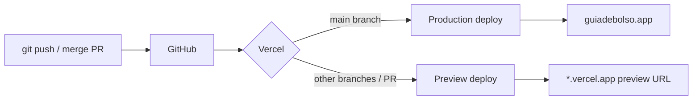

# Deployment guide

This guide covers deploying **Guia de Bolso** to production using **Vercel** (frontend + serverless API) and **Supabase** (database, auth, storage).

> **Variáveis:** [environment.md](./environment.md) · **Onboarding:** [onboarding.md](./onboarding.md) · **Migrations:** [migrations.md](./migrations.md)

| Environment | URL |
|-------------|-----|
| **Production** | https://guiadebolso.app |
| **Repository** | https://github.com/BrunoDislilerDev/guia-de-bolso |

---

## Architecture overview

```text
Developer machine
    │  git push
    ▼
GitHub (main / PR branches)
    │  webhook
    ▼
Vercel ──────────────────────────────┐
  • Next.js 16 build                 │
  • Static assets + SSR pages        │
  • Serverless /api/* (Claude)       │
    │ env: SUPABASE_*, ANTHROPIC_*   │
    ▼                                │
Supabase (us-west-2) ◄───────────────┘
  • PostgreSQL + RLS
  • Auth (Google, SMS/Twilio)
  • Storage (photos, avatars)
```

External services used at runtime (no Vercel env required unless noted):

- **Anthropic** — AI search & roteiros (`ANTHROPIC_API_KEY`)
- **Open-Meteo** — weather for home context and outdoor place detail (public API)
- **Google Maps** — admin Places autocomplete + Static Maps preview on place detail (`NEXT_PUBLIC_GOOGLE_MAPS_API_KEY`, optional; enable **Places API** and **Maps Static API**)

---

## Prerequisites

Before the first production deploy:

| Requirement | Notes |
|-------------|--------|
| GitHub repository | Connected to Vercel |
| Supabase project | Production project in `us-west-2` (or your chosen region) |
| Anthropic account | API key with billing enabled |
| Supabase Auth | Google OAuth app; Twilio for SMS OTP (via Supabase) |
| Node.js 20+ | Local builds and optional CI |

---

## Environment variables

**Full reference:** [environment.md](./environment.md).

### Local development

Copy the example file and fill in values:

```bash
cp .env.example .env.local
```

Never commit `.env.local` — it is in `.gitignore`.

### Vercel configuration

Set variables in **Vercel → Project → Settings → Environment Variables**.

Apply to **Production**, **Preview**, and **Development** as appropriate (preview can share production Supabase or use a separate Supabase project).

| Variable | Required | Scope | Description |
|----------|----------|-------|-------------|
| `NEXT_PUBLIC_SUPABASE_URL` | Yes | Client + Server | Supabase project URL (`https://<ref>.supabase.co`) |
| `NEXT_PUBLIC_SUPABASE_ANON_KEY` | Yes | Client + Server | Supabase **anon** / publishable key (RLS applies) |
| `ANTHROPIC_API_KEY` | Yes | Server only | Claude API secret for `/api/buscar` and `/api/roteiro` |
| `ANTHROPIC_MODEL` | Recommended | Server only | Model id, e.g. `claude-sonnet-4-5` (fallback in code if omitted) |
| `NEXT_PUBLIC_GOOGLE_MAPS_API_KEY` | Optional | Client | Admin Places Autocomplete (`EnderecoAutocomplete`); place detail static map (`getStaticMapUrl` in `lib/lugarDetalhe.js`) |
| `NEXT_PUBLIC_GOOGLE_WEB_CLIENT_ID` | Capacitor + Supabase | Client (build) | Native Google Sign-In on Android/iOS; same Web Client ID as Supabase Google provider |
| `NEXT_PUBLIC_GOOGLE_IOS_CLIENT_ID` | Capacitor iOS | Client (build) | iOS Google Sign-In only (`lib/nativeSocialLoginInit.js`); pair with `ios/GoogleAuth.xcconfig` |

### Variables you must NOT expose

| Variable | Why |
|----------|-----|
| `SUPABASE_SERVICE_ROLE_KEY` | Bypasses RLS — never use `NEXT_PUBLIC_*` or ship to the browser |
| `ANTHROPIC_API_KEY` | Must not use `NEXT_PUBLIC_` prefix |

The app uses only the **anon** key on client and server (`@supabase/ssr`). Server routes that load the public catalog use the same anon client with RLS.

### Example `.env.local`

```bash
NEXT_PUBLIC_SUPABASE_URL=https://xxxxxxxx.supabase.co
NEXT_PUBLIC_SUPABASE_ANON_KEY=eyJhbGciOiJIUzI1NiIsInR5cCI6IkpXVCJ9...

ANTHROPIC_API_KEY=sk-ant-api03-...
ANTHROPIC_MODEL=claude-sonnet-4-5

# Optional — Places Autocomplete (admin) + Static Maps (place detail)
NEXT_PUBLIC_GOOGLE_MAPS_API_KEY=AIza...
```

After changing env vars in Vercel, **redeploy** (or trigger a new deployment) so serverless functions and the client bundle pick up new values.

### Capacitor native apps (Android / iOS)

**Padrão (WebView remota):** o app nativo carrega `https://app.guiadebolso.app` (servidor real na Vercel). É o modo estável porque as rotas dinâmicas (detalhe de lugar/atrativo/categoria) dependem de conteúdo do banco em tempo de execução — um bundle estático só serviria os params pré-renderizados no build e retornaria 404 (com reload de página) para qualquer local novo. `npx cap sync` aplica a config nativa.

| Modo | Como ativar |
|------|-------------|
| **WebView remota** (padrão) | `npx cap sync` |
| **Live reload** (dev) | `CAPACITOR_LIVE_RELOAD_URL=http://IP:3000 npx cap sync` |
| **Bundle local estático** (experimental) | `CAPACITOR_USE_LOCAL_BUNDLE=1 npm run build:capacitor` — ⚠️ navegação para detalhes dinâmicos ainda não funciona nesse modo |

Native social login does **not** use `/auth/callback`.

| Platform | Google | Apple | Repo config |
|----------|--------|-------|-------------|
| Android | `NEXT_PUBLIC_GOOGLE_WEB_CLIENT_ID` on Vercel + SHA-1 on GCP OAuth client | — | `lib/nativeGoogleAuth.js` |
| iOS | Web + iOS client IDs on Vercel | Sign in with Apple | `ios/GoogleAuth.xcconfig`, `App.entitlements`, `AppDelegate.swift` |

Setup details: [authentication.md](./authentication.md#native-login-capacitor).

**Symptom:** home / Explorar show no places, empty sections, or an amber “Supabase não configurado no deploy” banner.

**Cause:** `NEXT_PUBLIC_SUPABASE_URL` and `NEXT_PUBLIC_SUPABASE_ANON_KEY` were missing at **build time** (the production JS bundle will not contain your project URL).

**Fix:**

1. Vercel → Project → **Settings** → **Environment Variables**
2. Add both variables for **Production** and **Preview** (values from Supabase → Settings → API Keys; use **anon** / **publishable**, not `service_role`)
3. **Deployments** → Redeploy latest (or push a new commit)
4. Optional: run `supabase/lugares_public_read.sql` in the SQL Editor if anon reads return permission errors

The production build fails on Vercel if these variables are absent (`next.config.mjs` guard).

---

## Build steps

### Local verification (before every production push)

```bash
# 1. Install dependencies
npm install

# 2. Lint (optional but recommended)
npm run lint

# 3. Production build
npm run build

# 4. Smoke-test production server locally
npm run start
# Open http://localhost:3000
```

### What `npm run build` does

| Step | Detail |
|------|--------|
| Framework | Next.js 16 (App Router) |
| Command | `next build` |
| Output | `.next/` — static pages, server components, API routes |
| Middleware | `middleware.js` — Supabase session refresh on matched routes |

### Vercel project settings

| Setting | Value |
|---------|--------|
| **Framework Preset** | Next.js |
| **Root Directory** | `.` (repository root) |
| **Build Command** | `npm run build` (default) |
| **Output Directory** | Next.js default (leave empty) |
| **Install Command** | `npm install` (default) |
| **Node.js Version** | **20.x** (recommended; set in Project → Settings → General) |

[`vercel.json`](../vercel.json) adds security headers (`X-Frame-Options`, `nosniff`, `Referrer-Policy`, `Permissions-Policy`). No custom rewrites are required for the default Next.js flow.

### Build-time vs runtime

- **`NEXT_PUBLIC_*`** — inlined at build time for client bundles; changing them requires a **new deployment**.
- **`ANTHROPIC_*` (no prefix)** — read at runtime in Route Handlers (`/api/*`); updating in Vercel applies on next invocation after redeploy.

---

## CI/CD workflow

### Primary pipeline: Vercel + GitHub

This project uses **Vercel’s Git integration** for deploys, plus **GitHub Actions** for lint/test/build on every PR (see below).



| Event | Vercel action |
|-------|----------------|
| Push to `main` | Production deployment |
| Pull request opened/updated | Preview deployment (unique URL) |
| Push to other branches | Preview (if enabled in Vercel) |

**Typical release flow:**

1. Develop on a feature branch → open PR → Vercel posts preview URL on the PR.
2. Test preview (see [Preview deployments](#preview-deployments)).
3. Merge to `main` → automatic production build and promote.
4. Run [production smoke tests](#production-smoke-tests).

### GitHub Actions (quality gate)

The repository ships [`.github/workflows/ci.yml`](../.github/workflows/ci.yml) — on PRs and pushes to `main`:

1. ESLint (`npm run lint`)
2. Unit tests (`npm test` — all `lib/*.test.js`)
3. Production build (`npm run build`)
4. Playwright smoke (`npm run test:e2e` — Chromium, server via `npm run start`)

Vercel still performs the deploy; Actions validates lint, logic, compile, and critical web routes.

To replicate locally or customize the workflow, reference:

```yaml
name: CI

on:
  push:
    branches: [main]
  pull_request:
    branches: [main]

jobs:
  quality:
    runs-on: ubuntu-latest
    steps:
      - uses: actions/checkout@v4
      - uses: actions/setup-node@v4
        with:
          node-version: "20"
          cache: npm
      - run: npm ci
      - run: npm run lint
      - run: npm test
      - run: npm run build
        env:
          NEXT_PUBLIC_SUPABASE_URL: ${{ secrets.NEXT_PUBLIC_SUPABASE_URL || 'https://placeholder.supabase.co' }}
          NEXT_PUBLIC_SUPABASE_ANON_KEY: ${{ secrets.NEXT_PUBLIC_SUPABASE_ANON_KEY || 'placeholder-anon-key' }}
          ANTHROPIC_API_KEY: ${{ secrets.ANTHROPIC_API_KEY || 'sk-placeholder' }}
          ANTHROPIC_MODEL: claude-sonnet-4-5
      - run: npx playwright install --with-deps chromium
      - run: npm run test:e2e
        env:
          CI: true
          NEXT_PUBLIC_SUPABASE_URL: ${{ secrets.NEXT_PUBLIC_SUPABASE_URL || 'https://placeholder.supabase.co' }}
          NEXT_PUBLIC_SUPABASE_ANON_KEY: ${{ secrets.NEXT_PUBLIC_SUPABASE_ANON_KEY || 'placeholder-anon-key' }}
          ANTHROPIC_API_KEY: ${{ secrets.ANTHROPIC_API_KEY || 'sk-placeholder' }}
          ANTHROPIC_MODEL: claude-sonnet-4-5
```

Add the same secrets in **GitHub → Repository → Settings → Secrets and variables → Actions** (optional — CI uses placeholders when empty). Vercel still performs the actual deploy; Actions validates the build and smoke routes.

### Deployment commands (manual)

Vercel CLI is optional:

```bash
npx vercel          # preview
npx vercel --prod   # production (requires linked project)
```

Day-to-day deploys are normally **`git push`** only.

---

## Supabase production setup

### 1. Auth URL configuration

**Supabase Dashboard → Authentication → URL Configuration**

| Field | Production value |
|-------|------------------|
| **Site URL** | `https://guiadebolso.app` |
| **Redirect URLs** | `https://guiadebolso.app/auth/callback` |

For **preview** deploys, add each origin you use:

```text
https://<branch>-<team>.vercel.app/auth/callback
https://*.vercel.app/auth/callback
```

(Use the exact patterns Supabase allows for your project; wildcard support may vary.)

### 2. Auth providers

| Provider | Configuration |
|----------|----------------|
| **Google** | OAuth client ID/secret in Supabase → Authentication → Providers |
| **Phone (SMS)** | Twilio credentials in Supabase (OTP login in `AuthFlow`) |

### 3. SQL migrations

Run scripts from [`/supabase`](../supabase) in the **SQL Editor** in order. **Authoritative order:** [Migrations → Manifest](./migrations.md#manifest) (base schema → premium → RLS → routes → security P0 → indexes/RPC).

Minimum for a legacy DB that already has base schema:

| Order | File |
|-------|------|
| 1 | Base schema (tables created in dashboard / legacy scripts) |
| 2 | `premium_usuario.sql` |
| 3 | `increment_uso_ia.sql` |
| 3b | `perfis_email_admin.sql` | `email` on `perfis` + admin SELECT policy |
| 3c | `premium_uso_diario.sql` *(optional)* — `COMMENT ON COLUMN` only |
| 4 | `perfis_premium_policies.sql` |
| 5 | `perfis_role_check.sql` |
| 6 | `tags_categorias.sql` |
| 7 | `fotos_migration.sql` |
| 8 | `storage-policies.sql` |
| 9 | `logs_policies.sql` |
| 10+ | See [migrations.md](./migrations.md#manifest) for full list (`lugares_visibilidade`, taxonomy, routes, `avaliacoes_moderacao`, `db_indexes_phase2`, etc.) |

After migrations:

- Confirm **RLS enabled** on each application table (repo scripts only enable `perfis` and `logs`; verify policies in Dashboard).
- Grant `authenticated` execute on `increment_busca_ia`, `increment_roteiro_ia`, `decrement_busca_ia`, `decrement_roteiro_ia`.

### 4. Storage buckets

Create **public** buckets if they do not exist:

| Bucket | Purpose |
|--------|---------|
| `lugares-fotos` | Place gallery (admin upload) |
| `rotas-fotos` | Route covers |
| `imagens` | User avatars (`avatars/{user_id}/`) — fallback if created |
| **Guia de Bolso - Imagens** | Production avatars (legacy bucket; primary in `lib/avatarStorage.js`) |

Apply policies from `fotos_migration.sql`, `storage-policies.sql`, and **`storage_avatar_legacy_bucket.sql`** for the legacy bucket.

Avatar upload in the app uses **`POST /api/perfil/avatar`** (requires `SUPABASE_SERVICE_ROLE_KEY` on Vercel).

### 5. First admin user

1. Sign up in production (Google or SMS).
2. In SQL Editor, set role on `perfis`:

```sql
UPDATE perfis SET role = 'admin' WHERE id = '<auth.users.uuid>';
```

3. Open `/admin` and confirm access.

---

## Preview deployments

| Topic | Guidance |
|-------|----------|
| **URL** | Vercel assigns `https://<project>-<hash>.vercel.app` per deployment |
| **Env vars** | Inherit Preview env in Vercel (can mirror Production or use a staging Supabase) |
| **Auth** | Add preview callback URL to Supabase redirect list |
| **AI usage** | Preview shares Anthropic quota if using the same API key |

Test on preview: home, login, `/api/buscar` (logged in), place detail, admin (if admin user exists in that DB).

---

## Production checklist

Use this list for **first launch** and **each major release**.

### Repository & Vercel

- [ ] GitHub repo connected to Vercel project
- [ ] Production branch set to `main` (or your default)
- [ ] Node.js **20.x** in Vercel project settings
- [ ] All [required environment variables](#environment-variables) set for **Production**
- [ ] Preview env vars set if PR previews use a real backend
- [ ] `npm run build` passes locally on release commit
- [ ] No secrets in git history (`.env.local` never committed)

### Supabase

- [ ] Production project region and backups understood (plan limits)
- [ ] Migrations applied in documented order
- [ ] RLS enabled and tested (anonymous read / authenticated write / admin writes)
- [ ] **Security P0** applied: `supabase/security_p0_complete.sql` (see [SECURITY_CHECKLIST.md](../SECURITY_CHECKLIST.md))
- [ ] RPC `increment_*_ia` and `decrement_*_ia` exist and are granted to `authenticated`
- [ ] Storage buckets + policies applied
- [ ] Auth Site URL and Redirect URLs include production (and previews if needed)
- [ ] Google OAuth and SMS tested end-to-end on production domain
- [ ] Capacitor iOS (physical device): Google native (`NEXT_PUBLIC_GOOGLE_IOS_CLIENT_ID` + `ios/GoogleAuth.xcconfig`) and Sign in with Apple (`App.entitlements`, Supabase Apple provider)
- [ ] Capacitor Android: native Google (`NEXT_PUBLIC_GOOGLE_WEB_CLIENT_ID`, release SHA-1 in GCP)
- [ ] At least one `admin` or `dev` user on `perfis`

### Application smoke tests

- [ ] Home loads — places, hero, search UI
- [ ] Guest can browse categories and place detail
- [ ] Login (Google + SMS) → redirect to `/` via `/auth/callback`
- [ ] Logged-in user: favorite, review submit (pending moderation)
- [ ] AI search (`POST /api/buscar`) — success and limit/paywall when applicable
- [ ] AI roteiro on home — generate and save
- [ ] Maps CTA on place detail opens Google / Apple / Waze
- [ ] Admin `/admin` — dashboard, edit place, moderate review
- [ ] Admin `/admin/logs` and `/admin/taxonomia` (admin role)
- [ ] Images load from Supabase Storage URLs

### Security

- [ ] `ANTHROPIC_API_KEY` only in server env (not `NEXT_PUBLIC_*`)
- [ ] Service role key **not** in Vercel or client
- [ ] Supabase redirect URLs limited to known domains
- [ ] Admin UI gated by `perfis.role` — operational: `admin` or `dev`; sensitive routes + contracts API: **`dev` only** (`lib/adminRoles.js`)
- [ ] Reviews public only when `status = aprovada`

### Observability & rollback

- [ ] Vercel deployment notifications enabled (email/Slack)
- [ ] Know how to open **Vercel → Deployments → Redeploy** previous build
- [ ] Supabase backup / PITR understood before destructive SQL
- [ ] Check Vercel function logs if `/api/*` returns 500
- [ ] Admin dashboard `logs` table receiving events (`acessou_app`, `login`, etc.)

### Post-deploy

- [ ] Update README or internal docs if URLs or env names changed
- [ ] Monitor Anthropic usage and Supabase quotas after launch week

---

## Production smoke tests (quick script)

| # | Action | Expected |
|---|--------|----------|
| 1 | Open `/` | Home sections load without console errors |
| 2 | Search while logged in | Results or empty state; usage counter updates |
| 3 | Open `/lugares/<id>` | Detail, photos, CTA |
| 4 | `/login` → Google or SMS | Session + avatar on home |
| 5 | `/favoritos` | List or empty state when logged in |
| 6 | `/roteiros` → create roteiro | Sheet works; save appears in list |
| 7 | `/admin` as admin | Dashboard metrics load |
| 8 | `/admin/logs` | Filter logs; open place from `ir_agora` row |
| 9 | `/categorias` | Explorar grid; submit review → pending + IA hint in admin |

---

## Rollback

| Layer | Action |
|-------|--------|
| **Application** | Vercel → Deployments → select previous successful deployment → **Redeploy** |
| **Database** | Avoid rolling back app without DB compatibility; use Supabase backups / PITR for data issues |
| **Env vars** | Revert in Vercel settings and redeploy |

---

## Monitoring

| Source | What to check |
|--------|----------------|
| **Vercel** | Build logs, Function logs for `/api/buscar`, `/api/roteiro`, `/api/uso-premium` |
| **Supabase** | Auth logs, API errors, disk usage, RLS denials |
| **Anthropic** | Token usage and rate limits |
| **App** | Admin → Dashboard → activity `logs` |

---

## Performance notes

- Place/route images are served from **Supabase Storage** (CDN). **Listing cards** use **`next/image`** with `sizes`, `quality={60}`, and `minimumCacheTTL: 2592000` (30 days) in `next.config.mjs`. **Thumbnails and heroes** use **`RemotePhoto`** (`components/shared/RemotePhoto.js`) to reduce Vercel Image Optimization quota.
- Home loads catalog in **two phases** (primary then nearby + weather) so hero/trending are not blocked by secondary fetches.
- Category page counts use **one** `lugares` query, not per-category `count` head requests.
- AI routes are **serverless** — cold starts possible after idle periods.
- Static map images on place detail call **Google Maps Static API** when the key is configured; otherwise the UI falls back to a Maps link.
- Middleware runs on most routes to refresh auth cookies (small overhead per request).

---

## Related documentation

- [Architecture](./architecture.md) — system design and auth flow
- [DATABASE_ARCHITECTURE.md](./DATABASE_ARCHITECTURE.md) — modeling, performance, roadmap
- [database.md](./database.md) — schema reference
- [migrations.md](./migrations.md) — SQL manifest and best practices
- [API](./api.md) — Route Handlers and env usage
- [Contributing](./contributing.md) — local development conventions
