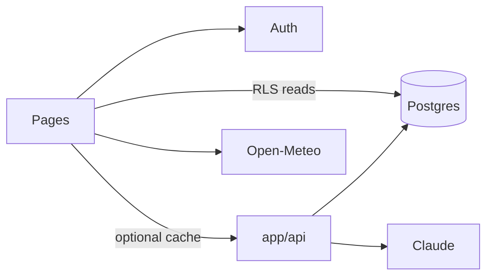

# Data flows

How data moves between the browser, Next.js on Vercel, and Supabase. Diagrams also in [architecture.md](../architecture.md#data-flow).

Portuguese original: [../data-flows.md](../data-flows.md).

---

## Principle

| Operation | Path |
|-----------|------|
| Public catalog read | Browser → Supabase (RLS) **or** `GET /api/lugares` (CDN cache) |
| User writes (favorite, review) | Browser → Supabase (RLS) |
| AI, quotas, rare service-role | Browser → `app/api/*` |
| Admin CMS | Browser → Supabase + Storage |
| Analytics | `lib/logs.js` → `logs` |

Secrets never in Client Components.

---

## Catalog reads

Most screens query `lugares` with `status = 'ativo'` through the anon client. Cards use denormalized ratings — no N+1.

`GET /api/lugares` (`lib/fetchLugaresApi.js`) supports `mode=populares|parceiros|curadoria`, `ids=`, `limit`, `categoria`. Cache headers: `lib/apiCacheHeaders.js`.

---

## AI search and itinerary

`POST /api/buscar`: auth → catalog snapshot → `buscaRetrieval` → **reserve** `increment_busca_ia` → Claude ranking → release on failure.

`POST /api/roteiro`: same pattern with `increment_roteiro_ia`. Persist with `POST /api/roteiro/salvar`; delete `DELETE /api/roteiro/[id]` (owner RLS). UI parses markdown via `lib/roteiroParse.js`.

---

## Authenticated writes

| Entity | Table | Notes |
|--------|-------|--------|
| Favorite | `favoritos` | |
| Review | `avaliacoes` | Starts `pendente`; `POST /api/avaliacoes/analisar` |
| Saved itinerary | `roteiros` | |
| Profile | `perfis` | Cannot self-escalate `role` / premium / IA counters |
| Feedback | `feedback` | Guests may go through service role on the server |

---

## Place detail and admin

Detail: `useLugarDetalhe` + `lib/lugarDetalhe.js` (public venue vs establishment). Weather: Open-Meteo from the browser. QR: `GET /q/[slug]` logs `escaneou_qr` then redirects.

Admin uploads go through compression (`lib/imageCompress.js`) and Storage policies.

Premium usage: `usePremiumUsage` hydrates localStorage then **server wins** via `GET /api/uso-premium`.

---

## Anti-patterns

- Reading `ANTHROPIC_API_KEY` in a Client Component
- Client `update` on `buscas_ia`
- Admin UI without RLS
- Treating `lugares.id` as UUID (production is **`bigint`**)

Related: [api.md](../api.md), [database.md](../database.md).
